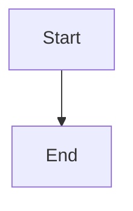

# Quick Start Guide

**Get your Physical AI & Humanoid Robotics text-book running in 5 minutes!**

---

## Prerequisites

- Node.js 18+ installed
- Git installed
- Text editor (VS Code recommended)

---

## Step 1: Resolve npm Installation (Choose One Method)

### Method A: Use Yarn (Recommended for Windows)
```bash
# Install yarn globally
npm install -g yarn

# Install dependencies
yarn install

# Start development server
yarn start
```

### Method B: Clear npm Cache
```bash
# Clear npm cache
npm cache clean --force

# Install with legacy peer deps
npm install --legacy-peer-deps

# Start development server
npm start
```

### Method C: Use npx (No Installation)
```bash
# Start directly with npx
npx docusaurus start
```

### Method D: Use WSL2 (Best for Windows)
```bash
# Open WSL2 terminal
wsl

# Navigate to project
cd /mnt/c/Users/HAJI\ LAPTOP\ KARACHI/Desktop/ai-book

# Install and start
npm install
npm start
```

---

## Step 2: Verify Local Site

Once the server starts, you should see:

```
[SUCCESS] Serving "ai-book" at http://localhost:3000/
```

**Open your browser**: http://localhost:3000

**You should see**:
- ✅ Homepage with hero section
- ✅ "Get Started" button
- ✅ Navigation sidebar
- ✅ Language switcher (English/اردو)
- ✅ Dark mode toggle

---

## Step 3: Test Key Features

### Test Navigation
1. Click "Get Started" button → Should go to Intro page
2. Click "Chapter 1: Introduction to AI" in sidebar
3. Navigate through all chapter sections

### Test Mermaid Diagrams
1. Go to Chapter 1 → Core Concepts
2. Scroll down to see 3 diagrams:
   - AI Hierarchy diagram
   - Neural Network Structure
   - AI Workflow

**All diagrams should render as graphics (not code blocks)**

### Test Search
1. Click search icon (top right)
2. Type "machine learning"
3. Should see instant results

### Test Language Switcher
1. Click language dropdown (top right)
2. Select "اردو" (Urdu)
3. UI should switch to Urdu with RTL layout
4. Switch back to English

### Test Dark Mode
1. Click sun/moon icon (top right)
2. Theme should toggle instantly

### Test Mobile View
1. Open browser dev tools (F12)
2. Toggle device toolbar (Ctrl+Shift+M)
3. Select iPhone or Android device
4. Verify responsive layout

---

## Step 4: Deploy to GitHub Pages

### 4.1: Update Configuration

Edit `docusaurus.config.js` (lines 14-20):

```javascript
url: 'https://YOUR-GITHUB-USERNAME.github.io',
baseUrl: '/ai-book/',
organizationName: 'YOUR-GITHUB-USERNAME',
projectName: 'ai-book',
```

**Replace `YOUR-GITHUB-USERNAME` with your actual GitHub username**

### 4.2: Create GitHub Repository

1. Go to https://github.com/new
2. Repository name: `ai-book`
3. Visibility: **Public** (required for free GitHub Pages)
4. **Do NOT** initialize with README
5. Click "Create repository"

### 4.3: Push Code to GitHub

```bash
# Add remote
git remote add origin https://github.com/YOUR-USERNAME/ai-book.git

# Push code
git branch -M main
git push -u origin main
```

### 4.4: Enable GitHub Pages

1. Go to repository Settings
2. Click "Pages" in left sidebar
3. Source: **Deploy from a branch**
4. Branch: **gh-pages** (will be created automatically)
5. Folder: **/ (root)**
6. Click "Save"

### 4.5: Wait for Deployment

1. Go to "Actions" tab
2. Watch "Deploy to GitHub Pages" workflow
3. Wait 2-3 minutes for completion
4. Visit: `https://YOUR-USERNAME.github.io/ai-book/`

---

## Step 5: Create Your First Chapter

### Use Chapter 1 as Template

```bash
# Copy Chapter 1 structure
cp -r docs/chapters/chapter-01-introduction docs/chapters/chapter-02-your-topic

# Edit files
cd docs/chapters/chapter-02-your-topic
```

### Required Files (All 8 Elements)

1. **index.md** - Chapter overview
2. **learning-objectives.md** - 5 measurable goals
3. **concepts.md** - Explanations + Mermaid diagrams
4. **hands-on-lab.md** - Tested code tutorial
5. **exercises.md** - Beginner/Intermediate/Advanced
6. **quiz.md** - 10 questions with explanations
7. **faqs.md** - 20+ Q&A pairs

### Update Sidebar

Edit `sidebars.js`:

```javascript
tutorialSidebar: [
  'intro',
  {
    type: 'category',
    label: 'Getting Started',
    items: [
      'chapters/chapter-01-introduction/index',
      'chapters/chapter-02-your-topic/index',  // Add this line
    ],
  },
],
```

### Test Your Chapter

```bash
npm start
# Navigate to your new chapter in the sidebar
```

---

## Common Issues & Solutions

### Issue 1: npm install fails
**Solution**: Use yarn or npx (see Step 1)

### Issue 2: Port 3000 already in use
**Solution**:
```bash
# Kill process on port 3000
npx kill-port 3000

# Or use different port
npm start -- --port 3001
```

### Issue 3: Mermaid diagrams don't render
**Solution**: Check syntax in concepts.md
```markdown
# Correct syntax

```

### Issue 4: Search doesn't work
**Solution**: Rebuild search index
```bash
npm run clear
npm start
```

### Issue 5: Language switcher missing
**Solution**: Verify i18n config in docusaurus.config.js (lines 26-41)

### Issue 6: GitHub Pages shows 404
**Solution**:
1. Check baseUrl matches repository name
2. Verify gh-pages branch exists
3. Wait 5-10 minutes for DNS propagation

---

## Useful Commands

```bash
# Development
npm start              # Start dev server
npm run build          # Build for production
npm run serve          # Preview production build
npm run clear          # Clear cache

# Deployment
npm run deploy         # Manual deploy to GitHub Pages

# Urdu locale
npm start -- --locale ur   # Start with Urdu

# Type checking
npm run typecheck      # Check TypeScript types
```

---

## Project Structure

```
ai-book/
├── docs/                          # Content files
│   ├── intro.md                   # Welcome page
│   └── chapters/
│       └── chapter-01-introduction/
│           ├── index.md           # Chapter overview
│           ├── learning-objectives.md
│           ├── concepts.md        # With Mermaid diagrams
│           ├── hands-on-lab.md    # Tested code
│           ├── exercises.md       # 3 difficulty levels
│           ├── quiz.md            # 10 questions
│           └── faqs.md            # RAG-ready Q&A
├── src/
│   ├── css/
│   │   ├── custom.css             # Theme styles
│   │   └── rtl.css                # Urdu RTL styles
│   └── pages/
│       └── index.tsx              # Homepage
├── static/
│   ├── img/
│   │   ├── logo.svg               # Platform logo
│   │   └── favicon.svg            # Favicon
│   └── robots.txt                 # SEO
├── i18n/ur/                       # Urdu translations
├── .github/workflows/
│   └── deploy.yml                 # CI/CD pipeline
├── docusaurus.config.js           # Main configuration
├── sidebars.js                    # Navigation structure
├── package.json                   # Dependencies
└── README.md                      # Documentation
```

---

## Next Steps

### Immediate
- [ ] Resolve npm installation (Step 1)
- [ ] Test local site (Step 2)
- [ ] Verify all features work (Step 3)

### Deployment
- [ ] Update GitHub username in config (Step 4.1)
- [ ] Create GitHub repository (Step 4.2)
- [ ] Push code and enable Pages (Step 4.3-4.4)
- [ ] Verify live site (Step 4.5)

### Content Creation
- [ ] Read CONTRIBUTING.md for authoring guide
- [ ] Create Chapter 2 using template (Step 5)
- [ ] Translate Chapter 1 to Urdu (optional)

### Future Enhancements
- [ ] Add more chapters
- [ ] Integrate RAG chatbot
- [ ] Add authentication
- [ ] Add personalization

---

## Getting Help

- **Setup Issues**: See README.md
- **Deployment Issues**: See docs/deployment-guide.md
- **Content Authoring**: See CONTRIBUTING.md
- **Success Criteria**: See SUCCESS-CRITERIA.md
- **Implementation Details**: See IMPLEMENTATION-SUMMARY.md

---

## Success Checklist

After completing Steps 1-3, you should have:

- ✅ Local development server running
- ✅ Homepage loads with hero section
- ✅ Chapter 1 accessible with all 8 sections
- ✅ Mermaid diagrams render correctly
- ✅ Search functionality works
- ✅ Language switcher toggles English/Urdu
- ✅ Dark mode toggle works
- ✅ Mobile responsive design works

After completing Step 4, you should have:

- ✅ Code pushed to GitHub
- ✅ GitHub Actions workflow runs successfully
- ✅ Site deployed to GitHub Pages
- ✅ Live site accessible at your GitHub Pages URL
- ✅ All features work on deployed site

---

**Ready to start? Begin with Step 1!**

For detailed information, see:
- **README.md** - Comprehensive project documentation
- **CONTRIBUTING.md** - Content authoring guide
- **docs/deployment-guide.md** - Detailed deployment instructions
