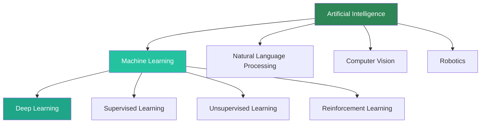
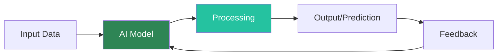
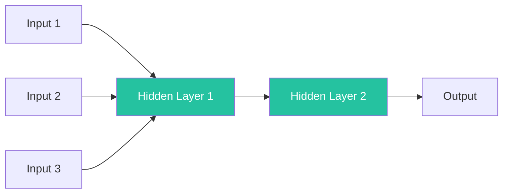

# Core Concepts

## What is Artificial Intelligence?

**Artificial Intelligence (AI)** is the simulation of human intelligence processes by machines, especially computer systems. These processes include:

- **Learning**: Acquiring information and rules for using it
- **Reasoning**: Using rules to reach approximate or definite conclusions
- **Self-correction**: Improving performance based on feedback

### The AI Hierarchy

AI encompasses several related but distinct concepts. Here's how they relate to each other:

**Key Relationships**:
- **AI** is the broadest concept - any technique that enables computers to mimic human intelligence
- **Machine Learning (ML)** is a subset of AI that learns from data without explicit programming
- **Deep Learning (DL)** is a subset of ML that uses neural networks with multiple layers

## Types of AI Systems

AI systems can be categorized based on their capabilities:

### 1. Narrow AI (Weak AI)

**Definition**: AI designed to perform a specific task or set of tasks.

**Characteristics**:
- Operates within a limited context
- Cannot transfer knowledge to other domains
- Most AI systems today are Narrow AI

**Examples**:
- Virtual assistants (Siri, Alexa)
- Recommendation systems (Netflix, Amazon)
- Image recognition systems
- Chess-playing programs

### 2. General AI (Strong AI)

**Definition**: AI with human-like intelligence that can understand, learn, and apply knowledge across different domains.

**Characteristics**:
- Can transfer learning between tasks
- Possesses common sense reasoning
- Currently theoretical - not yet achieved

**Status**: Research goal, not yet realized

### 3. Super AI

**Definition**: AI that surpasses human intelligence in all aspects.

**Characteristics**:
- Exceeds human cognitive abilities
- Can improve itself recursively
- Highly speculative

**Status**: Theoretical concept, subject of debate

## How AI Works: A Simple Model

**Process Breakdown**:

1. **Input Data**: Raw information (text, images, numbers)
2. **AI Model**: Algorithm that processes the data
3. **Processing**: Computation and pattern recognition
4. **Output**: Prediction, classification, or decision
5. **Feedback**: Used to improve the model (learning)

## Key AI Techniques

### Machine Learning

**Definition**: Algorithms that improve automatically through experience.

**Types**:
- **Supervised Learning**: Learning from labeled data
- **Unsupervised Learning**: Finding patterns in unlabeled data
- **Reinforcement Learning**: Learning through trial and error

### Neural Networks

**Definition**: Computing systems inspired by biological neural networks.

**Structure**:

**Components**:
- **Input Layer**: Receives data
- **Hidden Layers**: Process information
- **Output Layer**: Produces results

### Natural Language Processing (NLP)

**Definition**: Enabling computers to understand, interpret, and generate human language.

**Applications**:
- Language translation
- Sentiment analysis
- Chatbots
- Text summarization

## Real-World Applications

### Healthcare
- Disease diagnosis from medical images
- Drug discovery
- Personalized treatment plans

### Finance
- Fraud detection
- Algorithmic trading
- Credit scoring

### Transportation
- Autonomous vehicles
- Traffic prediction
- Route optimization

### Entertainment
- Content recommendations
- Game AI
- Music generation

## Ethical Considerations

### Bias in AI
AI systems can perpetuate or amplify human biases present in training data.

**Example**: Facial recognition systems showing lower accuracy for certain demographic groups.

### Privacy Concerns
AI systems often require large amounts of personal data.

**Challenge**: Balancing data utility with individual privacy rights.

### Accountability
When AI makes decisions, who is responsible for errors or harm?

**Question**: Should it be the developer, the user, or the AI system itself?

### Job Displacement
Automation through AI may eliminate certain jobs while creating new ones.

**Consideration**: How do we manage this transition fairly?

## Summary

In this section, you learned:

✅ The definition and scope of AI
✅ The relationship between AI, ML, and DL
✅ Different types of AI systems
✅ How AI works at a high level
✅ Key AI techniques and their applications
✅ Ethical considerations in AI development

---

**Next**: Apply what you've learned in the [Hands-On Lab](./hands-on-lab) where you'll build your first AI program!
