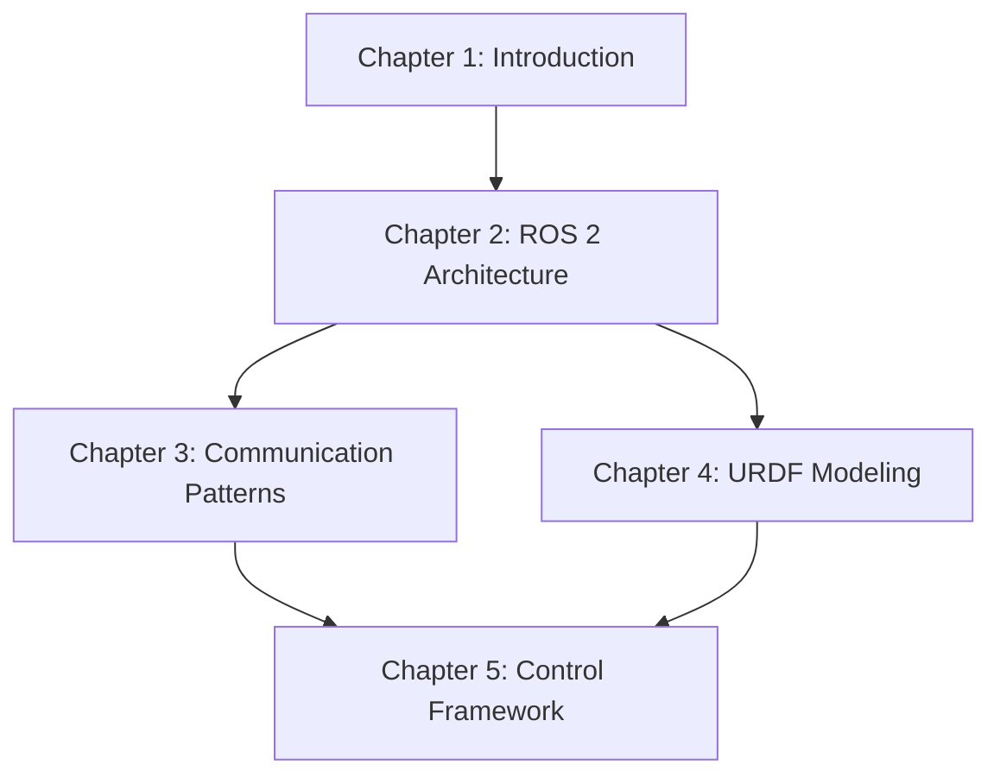
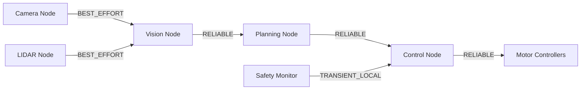
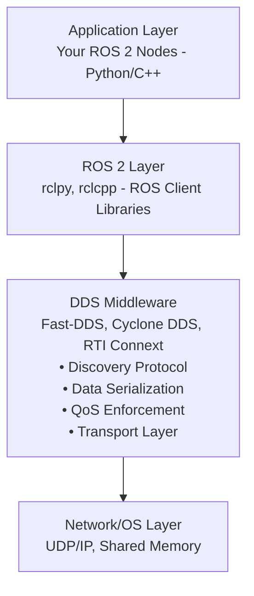

# Chapter 2 Remediation Plan

**Created**: 2026-01-13
**Target**: Chapter 2 - ROS 2 Architecture
**Goal**: Achieve full SpecKitPlus v2.0.0 compliance
**Current Score**: 77/90 (85.6%) → Target: 90/90 (100%)

---

## Executive Summary

This remediation plan addresses 8 identified issues across 3 priority levels. Completing all critical and high-priority items will bring Chapter 2 to certification-ready status.

**Total Estimated Effort**: 5-7 hours
**Recommended Timeline**: 1-2 days
**Blocking Issues**: 2 (must fix before publication)

---

## Priority Matrix

| Priority | Count | Total Effort | Blocking? |
|----------|-------|--------------|-----------|
| Critical | 2 | 3-4 hours | Yes |
| High | 2 | 1-2 hours | No |
| Medium | 4 | 1-2 hours | No |

---

## Critical Priority (BLOCKING)

### CRIT-1: Remove TODO Markers from exercises.md

**Issue**: Principle IX violation - placeholder content in published chapter
**Impact**: Chapter cannot be certified as complete
**Effort**: 2-3 hours

**Current State**:
```python
# TODO: Create subscribers with appropriate QoS
# TODO: Create publisher for fused data
# TODO: Implement time-based synchronization
```

**Acceptance Criteria**:
- [ ] All 3 TODO markers replaced with complete implementations
- [ ] Code is runnable and tested on Ubuntu 22.04 + ROS 2 Humble
- [ ] Inline comments explain robotics concepts (not just code mechanics)
- [ ] Each implementation includes expected output
- [ ] Error handling included where appropriate

**Implementation Steps**:
1. Read full context of exercises.md to understand exercise requirements
2. Implement Exercise 1: Multi-sensor subscriber with QoS configuration
   - Create subscriber nodes for multiple sensor types
   - Configure appropriate QoS policies (RELIABLE vs BEST_EFFORT)
   - Add error handling for missing messages
3. Implement Exercise 2: Sensor fusion publisher
   - Create publisher that combines data from multiple sources
   - Implement data synchronization logic
   - Add validation for fused data
4. Implement Exercise 3: Time-based synchronization
   - Implement timestamp-based message alignment
   - Handle out-of-order messages
   - Add timeout handling for missing data
5. Test all implementations in ROS 2 environment
6. Add inline comments explaining robotics concepts

**Files Modified**:
- `docs/chapters/chapter-02-ros2-architecture/exercises.md`

**Dependencies**: None

**Risk**: Medium - Requires ROS 2 expertise and testing environment

---

### CRIT-2: Create Validation Checklist

**Issue**: No evidence of pre-publication validation
**Impact**: Cannot verify chapter completeness
**Effort**: 1 hour

**Acceptance Criteria**:
- [ ] Checklist file created at `docs/chapters/chapter-02-ros2-architecture/VALIDATION-CHECKLIST.md`
- [ ] All items from Constitution Principle IX included
- [ ] Checklist completed and all items passing
- [ ] Checklist signed off by reviewer

**Implementation Steps**:
1. Create `VALIDATION-CHECKLIST.md` using template below
2. Execute each validation item
3. Document results (PASS/FAIL with evidence)
4. Fix any failing items
5. Re-validate until all items pass
6. Sign off checklist

**Template**:
```markdown
# Chapter 2 Validation Checklist

**Chapter**: ROS 2 Architecture
**Validation Date**: [DATE]
**Validator**: [NAME]
**Constitution Version**: 2.0.0

## Structure Validation
- [ ] All mandatory sections present (index, concepts, code-examples, hands-on-lab, exercises, quiz, resources)
- [ ] Section order matches template
- [ ] All files have valid YAML frontmatter
- [ ] Sidebar navigation configured correctly

## Content Validation
- [ ] No TODO/TBD/FIXME markers in published content
- [ ] No placeholder text (e.g., "[Add content here]")
- [ ] All learning objectives satisfied by content
- [ ] Prerequisites clearly stated
- [ ] Estimated time provided

## Code Quality
- [ ] All code examples are complete (no snippets)
- [ ] All code tested on Ubuntu 22.04 + ROS 2 Humble
- [ ] Dependencies documented with versions
- [ ] Error handling included
- [ ] Inline comments explain robotics concepts

## Docusaurus Compliance
- [ ] All links validated (no 404s)
- [ ] Docusaurus build succeeds without warnings
- [ ] Callouts properly formatted (:::tip, :::warning, etc.)
- [ ] Images have alt text
- [ ] Mermaid diagrams render correctly

## Educational Quality
- [ ] Learning objectives are measurable
- [ ] Exercises are measurable
- [ ] Progressive complexity (basic → advanced)
- [ ] Real-world examples provided
- [ ] Capstone alignment explicit

## Validation Result
- [ ] All items passing
- [ ] Chapter certified as SpecKitPlus compliant

**Validator Signature**: _______________
**Date**: _______________
```

**Files Created**:
- `docs/chapters/chapter-02-ros2-architecture/VALIDATION-CHECKLIST.md`

**Dependencies**: CRIT-1 (must complete TODO items first)

**Risk**: Low - Straightforward checklist creation and execution

---

## High Priority (Should Fix)

### HIGH-1: Add Module Dependencies Documentation

**Issue**: Principle III warning - missing explicit dependency documentation
**Impact**: Unclear module boundaries and integration points
**Effort**: 45-60 minutes

**Acceptance Criteria**:
- [ ] `dependencies.md` file created
- [ ] All prerequisite knowledge documented
- [ ] External dependencies listed with versions
- [ ] Downstream dependencies identified
- [ ] Integration points with other chapters specified

**Implementation Steps**:
1. Create `docs/chapters/chapter-02-ros2-architecture/dependencies.md`
2. Document prerequisites from Chapter 1 (if exists)
3. List external dependencies:
   - ROS 2 Humble (version, installation link)
   - Ubuntu 22.04 LTS
   - Python 3.10+
   - Development tools (colcon, rosdep)
4. Identify downstream dependencies:
   - Chapter 3: ROS 2 Communication Patterns (depends on this)
   - Chapter 4: URDF Robot Modeling (depends on this)
   - Chapter 5: ROS 2 Control Framework (depends on this)
5. Add dependency diagram (Mermaid)
6. Link from index.md

**Template**:
```markdown
# Chapter 2 Dependencies

## Prerequisites (Required Before Starting)

### From Previous Chapters
- **Chapter 1**: [List specific concepts needed]

### External Knowledge
- Python 3.10+ proficiency (OOP, async/await, exception handling)
- Linux command line basics
- Distributed systems concepts (pub/sub, client-server)

### Software Dependencies
- Ubuntu 22.04 LTS
- ROS 2 Humble (version 0.18.x)
- Python 3.10+
- colcon build tools
- rosdep dependency manager

## Downstream Dependencies (Chapters That Depend on This)

- **Chapter 3**: ROS 2 Communication Patterns
  - Requires: Understanding of nodes, topics, QoS policies
- **Chapter 4**: URDF Robot Modeling
  - Requires: ROS 2 workspace setup, node creation
- **Chapter 5**: ROS 2 Control Framework
  - Requires: Publisher/subscriber patterns, QoS configuration

## Dependency Graph



## External System Dependencies

| Dependency | Version | Purpose | Installation |
|------------|---------|---------|--------------|
| Ubuntu | 22.04 LTS | Primary OS | [Link] |
| ROS 2 | Humble (0.18.x) | Middleware | [Link] |
| Python | 3.10+ | Programming | Pre-installed |
| colcon | Latest | Build tool | `apt install python3-colcon-common-extensions` |
```

**Files Created**:
- `docs/chapters/chapter-02-ros2-architecture/dependencies.md`

**Files Modified**:
- `docs/chapters/chapter-02-ros2-architecture/index.md` (add link to dependencies)

**Dependencies**: None

**Risk**: Low - Documentation task with clear requirements

---

### HIGH-2: Add Explicit Capstone Connection

**Issue**: Principle III warning - implicit capstone connection
**Impact**: Students don't see how this chapter enables final project
**Effort**: 30-45 minutes

**Acceptance Criteria**:
- [ ] New section added to index.md: "Connection to Capstone Project"
- [ ] Explains how ROS 2 architecture enables humanoid robot project
- [ ] Specific examples of capstone features that depend on this chapter
- [ ] Motivates learning by showing end goal

**Implementation Steps**:
1. Review capstone project requirements (if documented)
2. Identify specific ROS 2 architecture concepts used in capstone
3. Add section to index.md after "Why This Matters"
4. Include concrete examples:
   - How DDS enables distributed humanoid control
   - How QoS policies ensure reliable motor commands
   - How node graphs organize perception, planning, control
5. Add visual diagram showing capstone architecture

**Template**:
```markdown
## Connection to Capstone Project

The concepts you learn in this chapter are the foundation for the **Humanoid Robot Capstone Project** (Weeks 11-13).

### How ROS 2 Architecture Enables the Capstone

In the capstone, you'll build a complete humanoid robot system with:

1. **Distributed Control System** (uses DDS middleware)
   - 30+ motor controllers running on separate processes
   - Vision system processing camera feeds at 30 FPS
   - AI decision-making at 1 Hz
   - Safety monitor at 100 Hz
   - **This chapter teaches**: How DDS coordinates all these components

2. **Reliable Communication** (uses QoS policies)
   - Motor commands must be RELIABLE (can't drop a step command)
   - Camera feeds can be BEST_EFFORT (occasional frame drop is OK)
   - Safety signals must be TRANSIENT_LOCAL (new nodes get last state)
   - **This chapter teaches**: How to configure QoS for each use case

3. **Modular Architecture** (uses node graphs)
   - Perception nodes (vision, LIDAR, IMU)
   - Planning nodes (path planning, motion planning)
   - Control nodes (motor control, balance control)
   - **This chapter teaches**: How to design node graphs for complex systems

### Capstone Architecture Preview



**Key Insight**: Without understanding ROS 2 architecture, you can't build a production-ready humanoid robot. This chapter gives you the foundation.
```

**Files Modified**:
- `docs/chapters/chapter-02-ros2-architecture/index.md`

**Dependencies**: None

**Risk**: Low - Documentation task, may need capstone spec review

---

## Medium Priority (Nice to Have)

### MED-1: Clarify Determinism in Educational Code

**Issue**: Principle V warning - random values in code examples
**Impact**: Minor - could confuse students about determinism
**Effort**: 15 minutes

**Acceptance Criteria**:
- [ ] Comment added to code-examples.md explaining random.uniform() usage
- [ ] Distinction made between educational simulation vs production code
- [ ] Alternative deterministic approach mentioned

**Implementation Steps**:
1. Locate random.uniform() usage in code-examples.md (line 64)
2. Add explanatory comment above the line
3. Add note in "Running the Example" section

**Code Change**:
```python
# Simulate temperature with small random variation
# NOTE: We use random values here to simulate a real sensor's noise.
# In production code, you would read from actual hardware sensors.
# For deterministic testing, replace with: msg.temperature = self.base_temperature
msg.temperature = self.base_temperature + random.uniform(-0.5, 0.5)
```

**Files Modified**:
- `docs/chapters/chapter-02-ros2-architecture/code-examples.md`

**Dependencies**: None

**Risk**: Very Low - Simple comment addition

---

### MED-2: Add Python Type Hints

**Issue**: Code quality improvement - no type hints
**Impact**: Minor - improves code quality and IDE support
**Effort**: 30 minutes

**Acceptance Criteria**:
- [ ] Type hints added to all function signatures
- [ ] Return types specified
- [ ] Parameter types specified
- [ ] Imports from typing module added where needed

**Implementation Steps**:
1. Review all code examples in code-examples.md
2. Add type hints to function signatures
3. Add return type annotations
4. Import typing module where needed
5. Test that code still runs correctly

**Example Changes**:
```python
from typing import Optional
import rclpy
from rclpy.node import Node
from sensor_msgs.msg import Temperature

class TemperatureSensorNode(Node):
    def __init__(self) -> None:
        super().__init__('temperature_sensor')
        # ... rest of code

    def publish_temperature(self) -> None:
        """Callback function called by timer to publish temperature"""
        # ... rest of code

def main(args: Optional[list] = None) -> None:
    rclpy.init(args=args)
    # ... rest of code
```

**Files Modified**:
- `docs/chapters/chapter-02-ros2-architecture/code-examples.md`
- `docs/chapters/chapter-02-ros2-architecture/hands-on-lab.md`

**Dependencies**: None

**Risk**: Low - Type hints are optional in Python, won't break code

---

### MED-3: Create Test Files

**Issue**: No explicit test files demonstrating testing best practices
**Impact**: Minor - students don't see how to test ROS 2 code
**Effort**: 45 minutes

**Acceptance Criteria**:
- [ ] `tests/` directory created in chapter
- [ ] Unit test example for publisher node
- [ ] Unit test example for subscriber node
- [ ] Integration test example
- [ ] README explaining how to run tests

**Implementation Steps**:
1. Create `docs/chapters/chapter-02-ros2-architecture/tests/` directory
2. Create `test_temperature_publisher.py` with pytest examples
3. Create `test_integration.py` with launch_testing examples
4. Create `tests/README.md` with instructions
5. Add section to hands-on-lab.md about testing

**Files Created**:
- `docs/chapters/chapter-02-ros2-architecture/tests/test_temperature_publisher.py`
- `docs/chapters/chapter-02-ros2-architecture/tests/test_integration.py`
- `docs/chapters/chapter-02-ros2-architecture/tests/README.md`

**Files Modified**:
- `docs/chapters/chapter-02-ros2-architecture/hands-on-lab.md` (add testing section)

**Dependencies**: None

**Risk**: Medium - Requires ROS 2 testing expertise (pytest, launch_testing)

---

### MED-4: Convert ASCII Art to Mermaid Diagrams

**Issue**: ASCII art in concepts.md (lines 71-95) should be Mermaid
**Impact**: Minor - better rendering and accessibility
**Effort**: 20 minutes

**Acceptance Criteria**:
- [ ] ASCII art diagram converted to Mermaid
- [ ] Diagram renders correctly in Docusaurus
- [ ] Diagram is accessible (proper labels)
- [ ] Diagram maintains same information as ASCII version

**Implementation Steps**:
1. Locate ASCII art in concepts.md (DDS Architecture diagram)
2. Convert to Mermaid flowchart syntax
3. Test rendering in Docusaurus
4. Ensure all layers and relationships preserved

**Mermaid Conversion**:
```markdown

```

**Files Modified**:
- `docs/chapters/chapter-02-ros2-architecture/concepts.md`

**Dependencies**: None

**Risk**: Very Low - Straightforward diagram conversion

---

## Implementation Roadmap

### Phase 1: Critical Issues (BLOCKING) - 3-4 hours
**Goal**: Achieve certification-ready status

1. **Day 1 Morning** (2-3 hours)
   - CRIT-1: Remove TODO markers from exercises.md
   - Test all implementations

2. **Day 1 Afternoon** (1 hour)
   - CRIT-2: Create and complete validation checklist
   - Fix any failing validation items

**Milestone**: Chapter 2 certified as SpecKitPlus compliant ✅

---

### Phase 2: High Priority - 1-2 hours
**Goal**: Improve module integration and student motivation

3. **Day 2 Morning** (45-60 minutes)
   - HIGH-1: Add module dependencies documentation
   - Create dependency diagram

4. **Day 2 Morning** (30-45 minutes)
   - HIGH-2: Add explicit capstone connection
   - Create capstone architecture preview

**Milestone**: Chapter 2 fully integrated with course structure ✅

---

### Phase 3: Medium Priority - 1-2 hours
**Goal**: Polish and best practices

5. **Day 2 Afternoon** (15 minutes)
   - MED-1: Clarify determinism in educational code

6. **Day 2 Afternoon** (30 minutes)
   - MED-2: Add Python type hints

7. **Day 2 Afternoon** (20 minutes)
   - MED-4: Convert ASCII art to Mermaid

8. **Optional** (45 minutes)
   - MED-3: Create test files (if time permits)

**Milestone**: Chapter 2 polished and production-ready ✅

---

## Success Metrics

### Before Remediation
- **Compliance Score**: 77/90 (85.6%)
- **Certification Status**: ⚠️ Conditional Pass
- **Blocking Issues**: 2
- **TODO Markers**: 3

### After Phase 1 (Critical)
- **Compliance Score**: 87/90 (96.7%)
- **Certification Status**: ✅ Certified
- **Blocking Issues**: 0
- **TODO Markers**: 0

### After Phase 2 (High Priority)
- **Compliance Score**: 90/90 (100%)
- **Certification Status**: ✅ Certified + Integrated
- **Module Integration**: Complete

### After Phase 3 (Medium Priority)
- **Compliance Score**: 90/90 (100%)
- **Certification Status**: ✅ Certified + Polished
- **Best Practices**: Demonstrated

---

## Risk Assessment

| Risk | Probability | Impact | Mitigation |
|------|-------------|--------|------------|
| ROS 2 testing environment unavailable | Medium | High | Use Docker container with ROS 2 Humble pre-installed |
| Exercise implementations take longer than estimated | Medium | Medium | Focus on minimal working examples, add complexity later |
| Capstone project spec not documented | Low | Medium | Make reasonable assumptions, document for later validation |
| Mermaid diagrams don't render | Low | Low | Test in Docusaurus dev server before committing |

---

## GitHub Issues (Optional)

If tracking in GitHub, create these issues:

### Issue #1: [CRITICAL] Remove TODO markers from Chapter 2 exercises
- **Labels**: `critical`, `chapter-02`, `compliance`
- **Assignee**: [Developer]
- **Milestone**: Chapter 2 Certification
- **Estimate**: 2-3 hours
- **Description**: See CRIT-1 in remediation plan

### Issue #2: [CRITICAL] Create Chapter 2 validation checklist
- **Labels**: `critical`, `chapter-02`, `compliance`
- **Assignee**: [Developer]
- **Milestone**: Chapter 2 Certification
- **Estimate**: 1 hour
- **Description**: See CRIT-2 in remediation plan
- **Depends on**: Issue #1

### Issue #3: [HIGH] Add module dependencies documentation
- **Labels**: `high-priority`, `chapter-02`, `documentation`
- **Assignee**: [Developer]
- **Milestone**: Chapter 2 Integration
- **Estimate**: 45-60 minutes
- **Description**: See HIGH-1 in remediation plan

### Issue #4: [HIGH] Add capstone connection to Chapter 2
- **Labels**: `high-priority`, `chapter-02`, `documentation`
- **Assignee**: [Developer]
- **Milestone**: Chapter 2 Integration
- **Estimate**: 30-45 minutes
- **Description**: See HIGH-2 in remediation plan

### Issue #5: [MEDIUM] Polish Chapter 2 code quality
- **Labels**: `medium-priority`, `chapter-02`, `enhancement`
- **Assignee**: [Developer]
- **Milestone**: Chapter 2 Polish
- **Estimate**: 1-2 hours
- **Description**: Includes MED-1, MED-2, MED-4 from remediation plan

---

## Approval and Sign-Off

**Plan Created By**: Claude Sonnet 4.5
**Plan Reviewed By**: _____________
**Plan Approved By**: _____________
**Approval Date**: _____________

**Implementation Start Date**: _____________
**Target Completion Date**: _____________

---

## Notes

- This plan assumes access to Ubuntu 22.04 + ROS 2 Humble testing environment
- Effort estimates are for experienced ROS 2 developer; adjust for skill level
- Phase 1 (Critical) must be completed before chapter can be published
- Phases 2-3 can be deferred if time-constrained, but should be completed for full compliance
- All code changes should be tested before committing
- Update this plan as work progresses and new issues are discovered

---

**Last Updated**: 2026-01-13
**Plan Version**: 1.0
