# Core Concepts: ROS 2 Architecture

## 1. What is ROS 2?

ROS 2 (Robot Operating System 2) is a **middleware framework** that provides:
- **Communication infrastructure** for distributed robot systems
- **Standard interfaces** for sensors, actuators, and algorithms
- **Development tools** for building, testing, and deploying robot software
- **Community ecosystem** of reusable packages and libraries

### ROS 2 is NOT:
- ❌ An operating system (it runs on Linux, Windows, macOS)
- ❌ A programming language (you write code in Python, C++, etc.)
- ❌ A simulation environment (though it integrates with Gazebo, Isaac Sim)
- ❌ A robot control library (it provides the communication layer)

### ROS 2 IS:
- ✅ A **middleware** layer for inter-process communication
- ✅ A **framework** for building modular robot software
- ✅ A **standard** for robotics software interfaces
- ✅ An **ecosystem** of tools and libraries

## 2. Why ROS 2 Replaced ROS 1

ROS 1 (released 2007) was revolutionary but had fundamental limitations that couldn't be fixed without a complete redesign. ROS 2 (released 2017) addressed these issues:

### Critical Limitations of ROS 1

| Issue | ROS 1 Problem | ROS 2 Solution |
|-------|---------------|----------------|
| **Single Point of Failure** | Required `roscore` master node—if it crashes, entire system fails | Fully distributed—no master node required |
| **Real-Time Performance** | TCP-based, unpredictable latency | DDS middleware with real-time guarantees |
| **Security** | No authentication or encryption | DDS Security (SROS2) with authentication, encryption, access control |
| **Multi-Robot Systems** | Difficult to coordinate multiple robots | Native multi-robot support via DDS domains |
| **Network Reliability** | Poor handling of WiFi dropouts | Configurable QoS policies for lossy networks |
| **Platform Support** | Linux-only (Ubuntu primarily) | Cross-platform: Linux, Windows, macOS, RTOS |
| **Production Use** | Designed for research labs | Production-ready with safety certifications |

### Real-World Impact

**Example: Autonomous Delivery Robots**
- **ROS 1**: If the master node crashes due to a network glitch, the robot stops dead—potentially in the middle of a street
- **ROS 2**: Each node operates independently; temporary network loss doesn't halt the robot

**Example: Humanoid Robot Control**
- **ROS 1**: TCP latency makes 1kHz motor control loops impossible
- **ROS 2**: DDS with RELIABLE QoS achieves sub-millisecond latency for real-time control

## 3. The DDS Middleware Layer

### What is DDS?

**DDS (Data Distribution Service)** is an OMG (Object Management Group) standard for real-time, distributed publish-subscribe communication. Think of it as "enterprise-grade pub/sub for mission-critical systems."

DDS is used in:
- 🚀 **Aerospace**: NASA, SpaceX, Boeing
- 🏥 **Medical Devices**: Surgical robots, patient monitoring
- 🏭 **Industrial Automation**: Factory robots, SCADA systems
- 🚗 **Automotive**: ADAS, autonomous driving

### DDS Architecture

```mermaid
graph TB
    APP["<b>Application Layer</b><br/>Your ROS 2 Nodes - Python/C++"]
    ROS["<b>ROS 2 Layer</b><br/>rclpy, rclcpp - ROS Client Libraries"]
    DDS["<b>DDS Middleware</b><br/>Fast-DDS, Cyclone DDS, RTI Connext<br/>• Discovery Protocol (finds other nodes)<br/>• Data Serialization (CDR format)<br/>• QoS Enforcement (reliability, durability)<br/>• Transport Layer (UDP, Shared Memory, TCP)"]
    NET["<b>Network/OS Layer</b><br/>UDP/IP, Shared Memory, etc."]

    APP <--> ROS
    ROS <--> DDS
    DDS <--> NET

    style APP fill:#E3F2FD,stroke:#1976D2,stroke-width:2px
    style ROS fill:#F3E5F5,stroke:#7B1FA2,stroke-width:2px
    style DDS fill:#FFF3E0,stroke:#F57C00,stroke-width:2px
    style NET fill:#E8F5E9,stroke:#388E3C,stroke-width:2px
```



### Key DDS Concepts

#### 1. Discovery Protocol (Automatic Node Detection)

Unlike ROS 1's master node, DDS uses **automatic discovery**:

```
Node A starts → Broadcasts "I exist!" via multicast UDP
Node B hears broadcast → Responds "I exist too!"
Nodes exchange metadata → Establish direct communication
```

**No configuration needed!** Nodes on the same network automatically find each other.

#### 2. Data-Centric Publish-Subscribe

DDS is **data-centric**, not message-centric:
- Publishers declare "I have data of type X"
- Subscribers declare "I want data of type X"
- DDS matches them automatically based on **topic name** and **data type**

#### 3. Quality of Service (QoS) Policies

QoS policies define **how** data is delivered, not just **what** data is delivered.

## 4. Quality of Service (QoS) Policies

QoS policies are the most important concept in ROS 2. They determine reliability, performance, and resource usage.

### Core QoS Policies

#### 1. Reliability

**RELIABLE**: Guaranteed delivery (like TCP)
- Use for: Commands, configuration, critical sensor data
- Trade-off: Higher latency, more bandwidth

**BEST_EFFORT**: No delivery guarantee (like UDP)
- Use for: High-frequency sensor streams (camera, LIDAR)
- Trade-off: Possible data loss, lower latency

```python
from rclpy.qos import QoSProfile, ReliabilityPolicy

# For critical commands
reliable_qos = QoSProfile(
    reliability=ReliabilityPolicy.RELIABLE,
    depth=10
)

# For high-frequency sensor data
best_effort_qos = QoSProfile(
    reliability=ReliabilityPolicy.BEST_EFFORT,
    depth=1
)
```

#### 2. Durability

**VOLATILE**: New subscribers only get future messages
- Use for: Real-time sensor streams
- Behavior: Join late → miss past data

**TRANSIENT_LOCAL**: New subscribers get last N messages
- Use for: Configuration, map data, robot state
- Behavior: Join late → receive cached messages

```python
from rclpy.qos import DurabilityPolicy

# Configuration that late-joiners need
config_qos = QoSProfile(
    durability=DurabilityPolicy.TRANSIENT_LOCAL,
    depth=1  # Keep last message
)
```

#### 3. History

**KEEP_LAST**: Keep last N messages in queue
- Use for: Most applications
- Depth=1: Only latest data matters (sensor streams)
- Depth=10: Keep recent history (commands)

**KEEP_ALL**: Keep all messages (until memory limit)
- Use for: Logging, data recording
- Risk: Memory exhaustion if consumer is slow

#### 4. Deadline

Maximum time between messages before considered "stale"

```python
from rclpy.qos import QoSProfile
from rclpy.duration import Duration

# Expect heartbeat every 100ms
heartbeat_qos = QoSProfile(
    deadline=Duration(seconds=0.1)
)
```

If deadline is missed, ROS 2 triggers a callback—useful for detecting sensor failures.

#### 5. Lifespan

Maximum time a message is valid

```python
# Message expires after 5 seconds
qos = QoSProfile(
    lifespan=Duration(seconds=5.0)
)
```

Prevents acting on stale data (e.g., old obstacle detections).

### QoS Compatibility

**Critical Rule**: Publisher and subscriber QoS must be **compatible**, not identical.

| Publisher | Subscriber | Compatible? |
|-----------|------------|-------------|
| RELIABLE | RELIABLE | ✅ Yes |
| RELIABLE | BEST_EFFORT | ✅ Yes (subscriber gets reliable data) |
| BEST_EFFORT | RELIABLE | ❌ No (subscriber demands reliability publisher can't provide) |
| BEST_EFFORT | BEST_EFFORT | ✅ Yes |

:::warning Common Mistake
If your subscriber isn't receiving data, check QoS compatibility first! Use `ros2 topic info -v <topic>` to see QoS settings.
:::

### Predefined QoS Profiles

ROS 2 provides standard profiles:

```python
from rclpy.qos import qos_profile_sensor_data, qos_profile_system_default

# For sensor streams (BEST_EFFORT, VOLATILE, depth=5)
camera_sub = node.create_subscription(
    Image,
    '/camera/image',
    callback,
    qos_profile_sensor_data
)

# For commands (RELIABLE, VOLATILE, depth=10)
cmd_pub = node.create_publisher(
    Twist,
    '/cmd_vel',
    qos_profile_system_default
)
```

## 5. Node Graph Architecture

### What is a Node?

A **node** is a single-purpose process that performs one task:
- ✅ Good: `camera_driver` node publishes images
- ✅ Good: `object_detector` node processes images
- ❌ Bad: `robot_brain` node does everything

**Design Principle**: One node = one responsibility (like microservices)

### Node Graph Example

```
┌──────────────┐         ┌──────────────┐         ┌──────────────┐
│   Camera     │ /image  │   Object     │ /objects│   Motion     │
│   Driver     ├────────>│   Detector   ├────────>│   Planner    │
│              │         │              │         │              │
└──────────────┘         └──────────────┘         └──────────────┘
                                                          │
                                                          │ /cmd_vel
                                                          ↓
                                                   ┌──────────────┐
                                                   │   Motor      │
                                                   │   Controller │
                                                   └──────────────┘
```

### Visualizing the Node Graph

ROS 2 provides `rqt_graph` to visualize running nodes:

```bash
ros2 run rqt_graph rqt_graph
```

This shows:
- **Nodes** (ovals)
- **Topics** (rectangles)
- **Connections** (arrows)

## 6. ROS 2 Communication Primitives (Preview)

ROS 2 provides three communication patterns (detailed in Chapter 3):

### Topics (Pub/Sub)
- **Use case**: Continuous data streams
- **Example**: Camera images, LIDAR scans, joint states
- **Pattern**: Many-to-many (multiple publishers/subscribers)

### Services (Request/Response)
- **Use case**: On-demand computation
- **Example**: "Calculate inverse kinematics for this pose"
- **Pattern**: One-to-one (client waits for server response)

### Actions (Goal-Based)
- **Use case**: Long-running tasks with feedback
- **Example**: "Navigate to waypoint X" (with progress updates)
- **Pattern**: One-to-one with feedback and cancellation

## 7. ROS 2 Domains

**Domains** isolate ROS 2 systems on the same network.

```bash
# Terminal 1: Domain 0 (default)
export ROS_DOMAIN_ID=0
ros2 run demo_nodes_py talker

# Terminal 2: Domain 1 (isolated)
export ROS_DOMAIN_ID=1
ros2 run demo_nodes_py listener  # Won't hear talker!
```

**Use cases**:
- Multiple robots in same building
- Isolating test environments
- Security boundaries

**Valid range**: 0-101 (102-232 reserved for vendors)

## 8. ROS 2 Workspace Structure

```
ros2_workspace/
├── src/                    # Source code
│   ├── my_robot_pkg/
│   │   ├── my_robot_pkg/   # Python package
│   │   ├── setup.py
│   │   └── package.xml
│   └── another_pkg/
├── build/                  # Build artifacts (auto-generated)
├── install/                # Installed packages (auto-generated)
└── log/                    # Build logs (auto-generated)
```

**Key principle**: Only edit files in `src/`. Never touch `build/` or `install/`.

## 9. Key Terminology

| Term | Definition | Example |
|------|------------|---------|
| **Node** | Single-purpose process | `camera_driver` |
| **Topic** | Named data stream | `/camera/image` |
| **Message** | Data structure | `sensor_msgs/Image` |
| **Publisher** | Sends data to topic | Camera node publishes images |
| **Subscriber** | Receives data from topic | Detector node subscribes to images |
| **Package** | Collection of nodes | `my_robot_bringup` |
| **Workspace** | Collection of packages | `~/ros2_ws` |
| **DDS** | Middleware layer | Fast-DDS, Cyclone DDS |
| **QoS** | Communication policy | RELIABLE, BEST_EFFORT |

## 10. ROS 2 vs. Traditional Distributed Systems

If you've worked with distributed systems, here's how ROS 2 compares:

| Concept | ROS 2 | Traditional Web |
|---------|-------|-----------------|
| Pub/Sub | Topics | Kafka, Redis Pub/Sub |
| RPC | Services | REST API, gRPC |
| Long Tasks | Actions | WebSockets, Server-Sent Events |
| Discovery | DDS automatic | Service mesh, DNS |
| Serialization | CDR (DDS) | JSON, Protobuf |
| Transport | UDP (default) | HTTP/TCP |
| Real-Time | Yes (with QoS) | No (best-effort) |

## Summary

**Key Takeaways**:
1. ROS 2 is a **middleware framework**, not an OS
2. **DDS** provides the distributed communication layer
3. **QoS policies** are critical for reliable robot behavior
4. **Nodes** are single-purpose processes that communicate via topics
5. ROS 2 is **production-ready** with real-time and security features
6. **No master node** = more robust than ROS 1

**Next Steps**:
- Set up your ROS 2 environment in the [Hands-On Lab](./hands-on-lab)
- Create your first nodes with [Code Examples](./code-examples)
- Test your understanding with [Exercises](./exercises)

:::tip Mental Model
Think of ROS 2 as a **nervous system**:
- **Nodes** = neurons (processing units)
- **Topics** = synapses (connections)
- **Messages** = nerve signals (data)
- **DDS** = the biological infrastructure that makes it all work
- **QoS** = signal priority and reliability settings
:::
