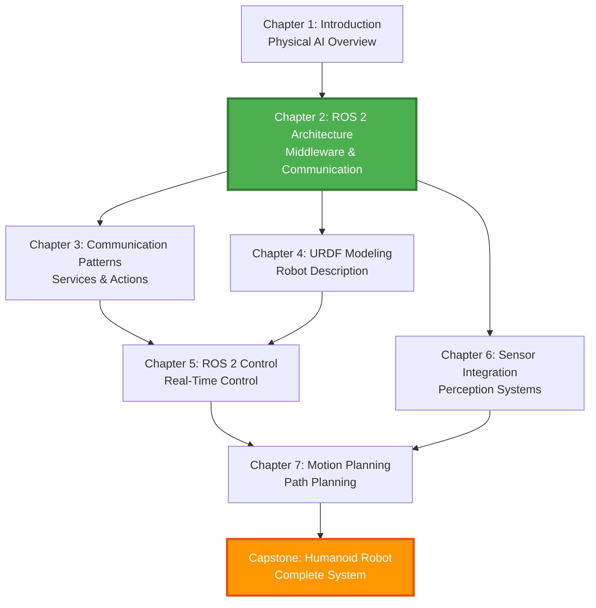

# Chapter 2: Dependencies

This document outlines all dependencies for Chapter 2 (ROS 2 Architecture), including prerequisites from previous chapters, external software requirements, and downstream chapters that build on this content.

---

## Prerequisites (Required Before Starting)

### From Previous Chapters

#### Chapter 1: Introduction to Physical AI & Robotics
**Required Concepts**:
- Understanding of what Physical AI is and why it matters
- Basic robotics terminology (sensors, actuators, perception, control)
- Overview of the robotics software stack
- Familiarity with the course structure and learning approach

**Specific Knowledge Needed**:
- Concept of distributed systems in robotics
- Understanding that robots have multiple components running simultaneously
- Basic awareness of real-time requirements in robotics

**Verification**: Complete Chapter 1 quiz with 80%+ score

---

### External Knowledge Requirements

#### Python Programming (Required)
- **Level**: Intermediate
- **Specific Skills**:
  - Object-oriented programming (classes, inheritance)
  - Async/await patterns and event-driven programming
  - Exception handling (try/except blocks)
  - Type hints (basic understanding)
  - List comprehensions and generators
- **Verification**: Can write a Python class with methods and error handling

#### Linux Command Line (Required)
- **Level**: Basic
- **Specific Skills**:
  - Navigating directories (cd, ls, pwd)
  - Running scripts and executables
  - Environment variables (export, echo $VAR)
  - Package management (apt install)
  - File permissions (chmod)
- **Verification**: Comfortable using terminal for basic tasks

#### Distributed Systems Concepts (Recommended)
- **Level**: Basic awareness
- **Specific Concepts**:
  - Client-server architecture
  - Publish-subscribe patterns
  - Network communication basics (TCP/UDP)
  - Message queues and event-driven systems
- **Verification**: Can explain pub/sub pattern in simple terms

---

## External Software Dependencies

### Operating System

| Dependency | Version | Required | Purpose |
|------------|---------|----------|---------|
| **Ubuntu** | 22.04 LTS (Jammy) | Yes | Primary development platform |
| Windows 10/11 | Latest | Alternative | Via WSL2 or native ROS 2 |
| macOS | 12+ | Alternative | Limited support, not recommended |

**Installation**: [Ubuntu 22.04 Download](https://ubuntu.com/download/desktop)

**Note**: All course materials are tested on Ubuntu 22.04 LTS. Other platforms may work but are not officially supported.

---

### ROS 2 Distribution

| Dependency | Version | Required | Purpose |
|------------|---------|----------|---------|
| **ROS 2 Humble** | 0.18.x | Yes | Robot middleware framework |
| ROS 2 Iron | 0.19.x | Alternative | Newer release, less tested |

**Installation**: [ROS 2 Humble Installation Guide](https://docs.ros.org/en/humble/Installation.html)

**Packages Required**:
```bash
# Desktop installation (includes rqt, rviz2, demos)
sudo apt install ros-humble-desktop

# Development tools
sudo apt install python3-colcon-common-extensions
sudo apt install python3-rosdep
```

**Verification**:
```bash
ros2 --version
# Expected output: ros2 cli version: 0.18.x
```

---

### Python Environment

| Dependency | Version | Required | Purpose |
|------------|---------|----------|---------|
| **Python** | 3.10+ | Yes | Programming language |
| pip | Latest | Yes | Package manager |
| venv | Latest | Recommended | Virtual environments |

**Pre-installed on Ubuntu 22.04**

**Additional Python Packages**:
```bash
# Install via pip (in virtual environment recommended)
pip install typing-extensions  # For advanced type hints
```

---

### Development Tools

| Tool | Version | Required | Purpose |
|------|---------|----------|---------|
| **colcon** | Latest | Yes | ROS 2 build tool |
| **rosdep** | Latest | Yes | Dependency management |
| VS Code | Latest | Recommended | IDE with ROS extensions |
| Git | 2.0+ | Recommended | Version control |

**Installation**:
```bash
# colcon and rosdep (included in ros-humble-desktop)
sudo apt install python3-colcon-common-extensions python3-rosdep

# VS Code (optional)
sudo snap install code --classic

# Git (usually pre-installed)
sudo apt install git
```

---

## Downstream Dependencies (Chapters That Depend on This)

### Chapter 3: ROS 2 Communication Patterns
**Depends on Chapter 2 for**:
- Understanding of ROS 2 nodes and node graphs
- Knowledge of topics and publishers/subscribers
- QoS policy configuration basics
- ROS 2 workspace setup

**Specific Concepts Used**:
- Creating and running ROS 2 nodes
- Publishing and subscribing to topics
- Configuring QoS profiles
- Using ROS 2 CLI tools (ros2 topic, ros2 node)

**Integration Point**: Chapter 3 extends Chapter 2 by adding services and actions to the communication patterns you've learned.

---

### Chapter 4: URDF Robot Modeling
**Depends on Chapter 2 for**:
- ROS 2 workspace structure
- Node creation and execution
- Understanding of ROS 2 packages
- Launch file basics (introduced in hands-on lab)

**Specific Concepts Used**:
- Creating ROS 2 packages
- Building with colcon
- Running nodes with ros2 run
- Visualizing with rviz2 (ROS 2 tool)

**Integration Point**: Chapter 4 uses ROS 2 infrastructure to load and visualize robot models.

---

### Chapter 5: ROS 2 Control Framework
**Depends on Chapter 2 for**:
- Publisher/subscriber patterns
- QoS policies for real-time control
- Node lifecycle management
- Parameter server usage

**Specific Concepts Used**:
- RELIABLE QoS for motor commands
- High-frequency publishing (100Hz+)
- Node lifecycle states (from Exercise 3)
- Dynamic parameter updates (from Exercise 5)

**Integration Point**: Chapter 5 applies ROS 2 architecture to real-time robot control.

---

### Chapter 6: Sensor Integration
**Depends on Chapter 2 for**:
- Sensor message types (Image, LaserScan, Imu)
- QoS policies for sensor data
- Multi-sensor fusion patterns (from Exercise 2)
- Time synchronization techniques

**Specific Concepts Used**:
- BEST_EFFORT QoS for high-bandwidth sensors
- Message buffering and synchronization
- Callback groups for parallel processing
- Sensor data visualization with rviz2

**Integration Point**: Chapter 6 builds on sensor fusion concepts from Exercise 2.

---

### Capstone Project (Weeks 11-13): Humanoid Robot System
**Depends on Chapter 2 for**:
- Distributed system architecture
- QoS policy selection for different components
- Node graph design
- Real-time communication patterns

**Specific Concepts Used**:
- All concepts from Chapter 2 are foundational for the capstone
- DDS middleware enables distributed humanoid control
- QoS policies ensure reliable motor commands and efficient sensor streaming
- Node graphs organize perception, planning, and control subsystems

**Integration Point**: Chapter 2 provides the architectural foundation for the entire capstone project.

---

## Dependency Graph



**Legend**:
- 🟢 **Green (Current)**: Chapter 2 - You are here
- 🟠 **Orange (Capstone)**: Final project that integrates all concepts
- ⬜ **White**: Future chapters that build on this foundation

---

## Critical Path Analysis

### Blocking Dependencies
These MUST be completed before starting Chapter 2:
1. ✅ Chapter 1 completion
2. ✅ Ubuntu 22.04 LTS installed
3. ✅ ROS 2 Humble installed
4. ✅ Python 3.10+ proficiency

### Recommended Dependencies
These improve learning experience but are not strictly required:
1. VS Code with ROS extensions
2. Git for version control
3. Basic understanding of distributed systems

### Optional Dependencies
These are helpful but can be learned as needed:
1. Docker (for containerized development)
2. Advanced Python features (decorators, metaclasses)
3. Network debugging tools (Wireshark, tcpdump)

---

## Dependency Verification Checklist

Before starting Chapter 2, verify you have:

### Software Installation
- [ ] Ubuntu 22.04 LTS running (native or VM)
- [ ] ROS 2 Humble installed (`ros2 --version` works)
- [ ] Python 3.10+ installed (`python3 --version` shows 3.10+)
- [ ] colcon build tool installed (`colcon --version` works)
- [ ] rosdep installed (`rosdep --version` works)

### Knowledge Prerequisites
- [ ] Completed Chapter 1 with 80%+ quiz score
- [ ] Can write Python classes with methods
- [ ] Comfortable using Linux terminal
- [ ] Understand basic pub/sub pattern

### Environment Setup
- [ ] ROS 2 environment sourced (`echo $ROS_DISTRO` shows "humble")
- [ ] Workspace directory created (`~/ros2_ws/src` exists)
- [ ] Terminal configured (`.bashrc` sources ROS 2 setup)

### Verification Commands
```bash
# Check ROS 2 installation
ros2 --version
ros2 pkg list | grep demo

# Check Python
python3 --version
python3 -c "import rclpy; print('rclpy available')"

# Check build tools
colcon --version
rosdep --version

# Check environment
echo $ROS_DISTRO
echo $AMENT_PREFIX_PATH
```

**Expected Output**:
- ROS 2 version: 0.18.x
- Python version: 3.10.x or higher
- ROS_DISTRO: humble
- All commands execute without errors

---

## Troubleshooting Common Dependency Issues

### Issue: "ros2: command not found"
**Cause**: ROS 2 environment not sourced
**Fix**:
```bash
source /opt/ros/humble/setup.bash
echo "source /opt/ros/humble/setup.bash" >> ~/.bashrc
```

### Issue: "No module named 'rclpy'"
**Cause**: ROS 2 Python libraries not installed
**Fix**:
```bash
sudo apt install python3-rclpy
```

### Issue: "colcon: command not found"
**Cause**: Build tools not installed
**Fix**:
```bash
sudo apt install python3-colcon-common-extensions
```

### Issue: "Permission denied" when running scripts
**Cause**: Script not executable
**Fix**:
```bash
chmod +x your_script.py
```

---

## Dependency Update Policy

### When to Update Dependencies
- **ROS 2 Humble**: Security patches only (no major version changes during course)
- **Ubuntu**: Security updates recommended, no distribution upgrade
- **Python packages**: Update only if required for bug fixes

### How to Update
```bash
# Update system packages
sudo apt update
sudo apt upgrade

# Update ROS 2 packages
sudo apt update
sudo apt upgrade ros-humble-*

# Update Python packages (in virtual environment)
pip install --upgrade package-name
```

### Version Pinning
For reproducibility, the course uses:
- Ubuntu 22.04 LTS (supported until 2027)
- ROS 2 Humble (supported until May 2027)
- Python 3.10+ (default on Ubuntu 22.04)

---

## Additional Resources

### Official Documentation
- [ROS 2 Humble Documentation](https://docs.ros.org/en/humble/)
- [Ubuntu 22.04 Release Notes](https://wiki.ubuntu.com/JammyJellyfish/ReleaseNotes)
- [Python 3.10 Documentation](https://docs.python.org/3.10/)

### Installation Guides
- [ROS 2 Installation (Ubuntu)](https://docs.ros.org/en/humble/Installation/Ubuntu-Install-Debians.html)
- [Colcon Tutorial](https://docs.ros.org/en/humble/Tutorials/Beginner-Client-Libraries/Colcon-Tutorial.html)
- [rosdep Tutorial](https://docs.ros.org/en/humble/Tutorials/Intermediate/Rosdep.html)

### Community Support
- [ROS Discourse](https://discourse.ros.org/) - Official forum
- [ROS Answers](https://answers.ros.org/) - Q&A site
- [GitHub Issues](https://github.com/ros2/ros2/issues) - Bug reports

---

## Summary

**Chapter 2 Dependencies at a Glance**:

| Category | Count | Status |
|----------|-------|--------|
| Previous Chapters | 1 (Chapter 1) | Required |
| External Software | 4 (Ubuntu, ROS 2, Python, Tools) | Required |
| Downstream Chapters | 5 (Chapters 3-7, Capstone) | Builds on this |
| Total Dependencies | 10 | Manageable |

**Key Takeaway**: Chapter 2 is a foundational chapter. Everything you learn here will be used throughout the rest of the course and in the capstone project. Take time to master these concepts before moving forward.

---

**Last Updated**: 2026-01-13
**Maintained By**: Course Development Team
