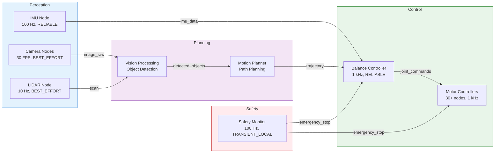

# Chapter 2: ROS 2 Architecture

## Module Overview

Welcome to the foundation of Physical AI! In this chapter, you'll learn how ROS 2 (Robot Operating System 2) provides the "nervous system" that connects sensors, actuators, and AI algorithms in modern robots.

**Duration**: Week 3 of the 13-week course

**What You'll Learn**:
- How ROS 2 enables distributed robot systems
- Why ROS 2 replaced ROS 1 for production robotics
- The DDS middleware layer and its role
- Quality of Service (QoS) policies for reliable communication
- Node graph architecture and design patterns

## Why This Matters

Modern robots are **distributed systems**:
- A humanoid robot has 30+ motors, each with its own controller
- Cameras stream 30 frames/second to vision algorithms
- LIDAR sensors publish 10Hz point clouds
- AI models make decisions at 1Hz
- Safety systems monitor everything at 100Hz

**The Challenge**: How do you coordinate all these components running at different rates, on different computers, with different reliability requirements?

**The Solution**: ROS 2 provides a standardized middleware that handles:
- ✅ Inter-process communication (topics, services, actions)
- ✅ Automatic node discovery (no configuration needed)
- ✅ Quality of Service policies (reliability, latency, bandwidth trade-offs)
- ✅ Real-time performance (sub-millisecond latency)
- ✅ Security (authentication, encryption, access control)

## Real-World Context

ROS 2 is used in:
- 🤖 **Humanoid Robots**: Boston Dynamics, Agility Robotics, Tesla Optimus
- 🚗 **Autonomous Vehicles**: Tier IV Autoware, Apex.AI
- 🏭 **Industrial Automation**: ABB, KUKA, Universal Robots
- 🚁 **Drones**: PX4, ArduPilot integration
- 🏥 **Medical Robots**: Surgical systems, rehabilitation robots
- 🌌 **Space Exploration**: NASA Mars rovers, lunar landers

## Connection to Capstone Project

The concepts you learn in this chapter are the **foundation for the Humanoid Robot Capstone Project** (Weeks 11-13). Without understanding ROS 2 architecture, you cannot build a production-ready humanoid robot system.

### How ROS 2 Architecture Enables the Capstone

In the capstone, you'll build a complete humanoid robot system with multiple subsystems running simultaneously. Here's how Chapter 2 concepts enable each component:

#### 1. Distributed Control System (uses DDS middleware)

**Capstone Requirement**: Coordinate 30+ motor controllers, vision processing, AI decision-making, and safety monitoring—all running at different rates on different processes.

**Chapter 2 Teaches**:
- How DDS middleware enables automatic node discovery
- How nodes communicate without a central master
- How to design node graphs for complex systems

**Real Example from Capstone**:
```
Motor Controllers (30+ nodes) → 1kHz control loop
Vision Processing (3 nodes)   → 30 FPS camera processing
AI Decision Making (1 node)    → 1 Hz planning updates
Safety Monitor (1 node)        → 100 Hz emergency detection
```

Without DDS, you'd need to manually configure connections between 35+ processes. With ROS 2, they discover each other automatically.

#### 2. Reliable Communication (uses QoS policies)

**Capstone Requirement**: Different data streams have different reliability needs. Motor commands must never be dropped, but occasional camera frame loss is acceptable.

**Chapter 2 Teaches**:
- How to configure QoS policies for different use cases
- When to use RELIABLE vs BEST_EFFORT
- How to use TRANSIENT_LOCAL for configuration data

**Real Example from Capstone**:
```python
# Motor commands: RELIABLE (can't drop a step command)
motor_qos = QoSProfile(reliability=ReliabilityPolicy.RELIABLE)

# Camera feeds: BEST_EFFORT (occasional frame drop is OK)
camera_qos = QoSProfile(reliability=ReliabilityPolicy.BEST_EFFORT)

# Safety signals: TRANSIENT_LOCAL (new nodes get last state)
safety_qos = QoSProfile(
    reliability=ReliabilityPolicy.RELIABLE,
    durability=DurabilityPolicy.TRANSIENT_LOCAL
)
```

Without proper QoS configuration, your robot might:
- Drop critical motor commands (robot falls)
- Waste bandwidth retransmitting camera frames (network congestion)
- Miss safety signals when nodes restart (dangerous)

#### 3. Modular Architecture (uses node graphs)

**Capstone Requirement**: Organize perception, planning, and control subsystems so they can be developed, tested, and debugged independently.

**Chapter 2 Teaches**:
- How to design node graphs with clear responsibilities
- How to use topics for data flow between nodes
- How to visualize system architecture with rqt_graph

**Real Example from Capstone**:



**Key Insight**: Each colored box is a subsystem you can develop and test independently. ROS 2 architecture makes this modular design possible.

### What You'll Build in the Capstone

By Week 13, you'll have a complete humanoid robot system that:

1. **Perceives its environment**
   - Processes camera, LIDAR, and IMU data (uses sensor fusion from Exercise 2)
   - Detects objects and obstacles (uses vision processing)
   - Maintains spatial awareness (uses SLAM algorithms)

2. **Plans its actions**
   - Generates walking trajectories (uses motion planning)
   - Avoids obstacles dynamically (uses real-time replanning)
   - Coordinates arm and leg movements (uses whole-body control)

3. **Controls its body**
   - Maintains balance at 1 kHz (uses RELIABLE QoS from this chapter)
   - Commands 30+ motors simultaneously (uses distributed architecture)
   - Responds to safety signals instantly (uses TRANSIENT_LOCAL QoS)

4. **Operates safely**
   - Monitors system health continuously (uses lifecycle management from Exercise 3)
   - Triggers emergency stops when needed (uses high-priority messages)
   - Logs all events for debugging (uses parameter server from Exercise 5)

### Why This Chapter Matters for Your Career

**Industry Reality**: Every robotics company uses ROS 2 or similar middleware. Understanding these concepts is not optional—it's the foundation of professional robotics software engineering.

**What Employers Expect**:
- Can design node graphs for complex systems ✅ (learned in this chapter)
- Understands QoS trade-offs ✅ (learned in this chapter)
- Can debug distributed systems ✅ (learned in Exercise 8)
- Knows when to use topics vs services vs actions ✅ (learned in this chapter)

**Career Path**: Master this chapter → Build impressive capstone → Land robotics job

### Motivation: See the End Goal

When you're debugging QoS mismatches or struggling with node discovery, remember: you're building the skills to create a walking, talking humanoid robot. Every concept in this chapter is a building block for that goal.

**By the end of this course, you'll be able to say**:
> "I built a complete humanoid robot system with 35+ nodes, real-time control at 1 kHz, sensor fusion from multiple sources, and AI-driven decision making—all coordinated through ROS 2 architecture."

That's a portfolio project that opens doors.

---

## Connection to Previous Knowledge

You've already mastered:
- **Python async/await**: ROS 2 uses similar event-driven patterns
- **API design**: ROS 2 topics/services are like REST APIs for robots
- **Distributed systems**: ROS 2 is a specialized pub/sub system
- **Cloud-native**: ROS 2 nodes are like microservices

**New concepts**:
- **Middleware**: The communication layer between processes
- **DDS**: Enterprise-grade pub/sub for real-time systems
- **QoS policies**: Fine-grained control over reliability vs. performance
- **Physical constraints**: Dealing with sensors, actuators, and real-time deadlines

## Chapter Structure

### 1. [Learning Objectives](./learning-objectives)
Clear, measurable goals for this chapter

### 2. [Core Concepts](./concepts)
Deep dive into ROS 2 architecture, DDS, and QoS policies

### 3. [Code Examples](./code-examples)
Working Python code demonstrating publishers, subscribers, and QoS

### 4. [Hands-On Lab](./hands-on-lab)
Build a complete sensor monitoring system

### 5. [Exercises](./exercises)
Practice problems to reinforce learning

### 6. [Quiz](./quiz)
Test your understanding with 15 questions

### 7. [FAQs](./faqs)
Common questions and troubleshooting

### 8. [Additional Resources](./resources)
Curated links for deeper learning

## Prerequisites Check

Before starting this chapter, ensure you have:

✅ **Python 3.10+** proficiency
- Object-oriented programming
- Async/await patterns
- Exception handling

✅ **Linux command line** basics
- Navigating directories
- Running scripts
- Environment variables

✅ **Distributed systems** concepts
- Client-server architecture
- Publish-subscribe patterns
- Network communication basics

✅ **Development environment**
- Ubuntu 22.04 (native or VM)
- ROS 2 Humble installed
- VS Code or preferred IDE

:::tip Installation Help
If you haven't installed ROS 2 yet, follow the [official installation guide](https://docs.ros.org/en/humble/Installation.html) or use the setup script in the course repository.
:::

## Learning Approach

This chapter uses a **concept-first, code-second** approach:

1. **Understand WHY** before HOW
   - Why does ROS 2 use DDS instead of simple TCP?
   - Why do we need QoS policies?

2. **See working code** before building your own
   - Study complete examples
   - Understand each line

3. **Practice incrementally**
   - Start with minimal examples
   - Add complexity gradually

4. **Debug systematically**
   - Use ROS 2 CLI tools
   - Understand error messages

## Success Criteria

By the end of this chapter, you should be able to:

1. ✅ Explain the role of DDS middleware in ROS 2
2. ✅ Create Python nodes with publishers and subscribers
3. ✅ Configure QoS policies for different use cases
4. ✅ Debug communication issues using ROS 2 CLI tools
5. ✅ Design node graphs for multi-component systems
6. ✅ Understand when to use topics vs. services vs. actions

## Estimated Time

- **Reading**: 2-3 hours
- **Code examples**: 2-3 hours
- **Hands-on lab**: 3-4 hours
- **Exercises**: 2-3 hours
- **Total**: 10-15 hours

:::note Pacing
This is Week 3 content. Take your time to understand the concepts deeply—they're the foundation for everything that follows.
:::

## What's Next?

After mastering ROS 2 architecture:
- **Chapter 3**: ROS 2 Communication Patterns (topics, services, actions)
- **Chapter 4**: URDF Robot Modeling
- **Chapter 5**: ROS 2 Control Framework

Each chapter builds on the previous one, so ensure you're comfortable with this material before moving forward.

---

**Ready to begin?** Start with [Learning Objectives](./learning-objectives) to see exactly what you'll master in this chapter.

:::tip Study Strategy
1. Read [Core Concepts](./concepts) first for the big picture
2. Run [Code Examples](./code-examples) to see it in action
3. Complete [Hands-On Lab](./hands-on-lab) to build something real
4. Test yourself with [Exercises](./exercises) and [Quiz](./quiz)
5. Refer to [FAQs](./faqs) and [Resources](./resources) as needed
:::
