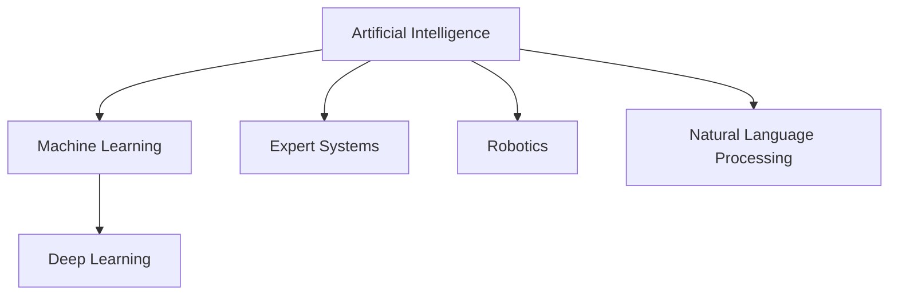
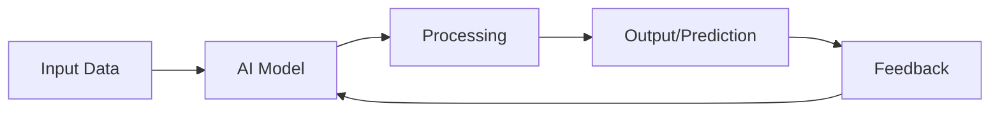
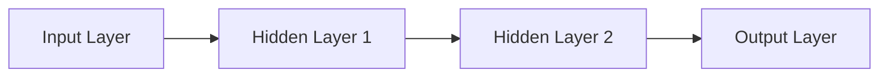

# بنیادی تصورات

## مصنوعی ذہانت کیا ہے؟

**مصنوعی ذہانت (AI)** کمپیوٹر سائنس کی ایک شاخ ہے جو ذہین مشینیں بنانے پر مرکوز ہے جو ایسے کام انجام دے سکیں جن میں عام طور پر انسانی ذہانت کی ضرورت ہوتی ہے۔ ان کاموں میں شامل ہیں:

- **بصری ادراک** (Visual perception): تصاویر اور ویڈیوز کو سمجھنا
- **تقریر کی پہچان** (Speech recognition): بولی جانے والی زبان کو سمجھنا
- **فیصلہ سازی** (Decision-making): معلومات کی بنیاد پر انتخاب کرنا
- **زبان کا ترجمہ** (Language translation): ایک زبان سے دوسری زبان میں ترجمہ کرنا

### AI کا درجہ بندی

یہ ڈایاگرام دکھاتا ہے کہ کیسے AI ایک وسیع میدان ہے جس میں مشین لرننگ اور ڈیپ لرننگ جیسے ذیلی شعبے شامل ہیں۔

## AI کی اقسام

### 1. Narrow AI (کمزور AI)

**Narrow AI** یا **Weak AI** ایسے AI نظام ہیں جو مخصوص کاموں کے لیے ڈیزائن کیے گئے ہیں۔ یہ آج کل سب سے عام قسم کی AI ہے۔

**مثالیں**:
- **Siri, Alexa, Google Assistant**: وائس اسسٹنٹس
- **Netflix, YouTube**: سفارشات کے نظام
- **Gmail**: سپیم فلٹرز
- **Tesla Autopilot**: خود کار ڈرائیونگ کی خصوصیات
- **روبوٹک آرمز**: فیکٹری میں مینیپولیشن کے کام

**خصوصیات**:
- ایک مخصوص کام میں ماہر
- اپنے ڈومین سے باہر کام نہیں کر سکتا
- انسانی سطح کی عمومی ذہانت نہیں رکھتا

### 2. General AI (مضبوط AI)

**General AI** یا **Strong AI** ایسے نظام ہیں جو انسانی سطح کی ذہانت رکھتے ہیں اور کسی بھی ذہنی کام کو انجام دے سکتے ہیں جو انسان کر سکتا ہے۔

**حیثیت**: ابھی تک موجود نہیں - یہ تحقیق کا ایک فعال شعبہ ہے۔

**خصوصیات**:
- مختلف ڈومینز میں سیکھنے اور لاگو کرنے کی صلاحیت
- انسانوں کی طرح استدلال اور مسئلہ حل کرنا
- خود آگاہی اور شعور (ممکنہ طور پر)

### 3. Super AI

**Super AI** ایسی مصنوعی ذہانت ہے جو تمام شعبوں میں انسانی ذہانت سے بہتر ہے - تخلیقیت، عمومی حکمت، اور سماجی مہارتوں سمیت۔

**حیثیت**: نظریاتی - ابھی تک موجود نہیں اور ممکنہ طور پر دہائیوں دور ہے۔

**خدشات**:
- کنٹرول اور حفاظت کے مسائل
- اخلاقی اور وجودی خطرات
- انسانیت پر اثرات

## AI کیسے کام کرتی ہے؟

### بنیادی ورک فلو

1. **Input Data**: AI نظام کو ڈیٹا فراہم کیا جاتا ہے (تصاویر، متن، آڈیو، وغیرہ)
2. **AI Model**: ماڈل ڈیٹا کو پروسیس کرتا ہے
3. **Processing**: الگورتھم پیٹرن تلاش کرتے ہیں اور حساب کتاب کرتے ہیں
4. **Output**: نظام پیشین گوئی یا فیصلہ فراہم کرتا ہے
5. **Feedback**: نتائج کو بہتر بنانے کے لیے استعمال کیا جاتا ہے

### نیورل نیٹ ورکس

نیورل نیٹ ورکس AI کی بنیاد ہیں، جو انسانی دماغ سے متاثر ہیں:

**کیسے کام کرتے ہیں**:
- **Input Layer**: خام ڈیٹا وصول کرتی ہے
- **Hidden Layers**: پیٹرن اور خصوصیات نکالتی ہیں
- **Output Layer**: حتمی پیشین گوئی فراہم کرتی ہے

ہر لیئر میں "neurons" ہوتے ہیں جو ڈیٹا کو تبدیل کرتے ہیں اور اگلی لیئر کو بھیجتے ہیں۔

## اہم AI تکنیکیں

### 1. مشین لرننگ (Machine Learning)

مشین لرننگ AI کا ایک ذیلی مجموعہ ہے جہاں نظام واضح طور پر پروگرام کیے بغیر ڈیٹا سے سیکھتے ہیں۔

**اقسام**:
- **Supervised Learning**: لیبل شدہ ڈیٹا کے ساتھ تربیت
- **Unsupervised Learning**: بغیر لیبل کے ڈیٹا میں پیٹرن تلاش کرنا
- **Reinforcement Learning**: انعامات اور سزاؤں کے ذریعے سیکھنا

### 2. ڈیپ لرننگ (Deep Learning)

ڈیپ لرننگ مشین لرننگ کا ایک ذیلی مجموعہ ہے جو کئی لیئرز والے نیورل نیٹ ورکس استعمال کرتا ہے۔

**اطلاقات**:
- تصویر کی پہچان
- قدرتی زبان کی پروسیسنگ
- تقریر کی پہچان
- خود کار گاڑیاں
- روبوٹک کنٹرول اور مینیپولیشن

### 3. قدرتی زبان کی پروسیسنگ (NLP)

NLP AI کا وہ شعبہ ہے جو کمپیوٹرز کو انسانی زبان کو سمجھنے، تشریح کرنے، اور پیدا کرنے میں مدد کرتا ہے۔

**مثالیں**:
- ChatGPT, Claude
- Google Translate
- Sentiment Analysis
- Text Summarization

## حقیقی دنیا کی اطلاقات

### صحت کی دیکھ بھال
- **بیماری کی تشخیص**: AI ایکس رے اور MRI اسکینز کا تجزیہ کرتی ہے
- **دوا کی دریافت**: نئی دوائیوں کی شناخت میں تیزی
- **ذاتی نوعیت کا علاج**: مریض کے ڈیٹا کی بنیاد پر علاج کی سفارشات

### مالیات
- **دھوکہ دہی کا پتہ لگانا**: مشکوک لین دین کی شناخت
- **الگورتھمک ٹریڈنگ**: خودکار سٹاک ٹریڈنگ
- **کریڈٹ اسکورنگ**: قرض کی منظوری کے فیصلے

### نقل و حمل
- **خود کار گاڑیاں**: Tesla, Waymo
- **ٹریفک کی اصلاح**: ٹریفک کے بہاؤ کو بہتر بنانا
- **روٹ کی منصوبہ بندی**: GPS نیویگیشن

### روبوٹکس اور فزیکل AI
- **ہیومنائیڈ روبوٹس**: انسان نما روبوٹس جو انسانوں کے ساتھ تعامل کرتے ہیں
- **روبوٹک مینیپولیشن**: اشیاء کو پکڑنا اور منتقل کرنا
- **لوکوموشن**: چلنا، دوڑنا، اور حرکت کرنا
- **صنعتی آٹومیشن**: فیکٹریوں میں اسمبلی لائنز

## اخلاقی تحفظات

### تعصب اور منصفانہ

AI نظام تربیتی ڈیٹا میں موجود تعصبات کو منعکس کر سکتے ہیں۔

**مثال**: چہرے کی پہچان کے نظام جو مختلف نسلوں کے لیے مختلف درستگی رکھتے ہیں۔

**حل**:
- متنوع تربیتی ڈیٹا
- باقاعدہ آڈٹ اور جانچ
- شفاف الگورتھم

### رازداری

AI نظام بڑی مقدار میں ذاتی ڈیٹا جمع اور تجزیہ کرتے ہیں۔

**خدشات**:
- ڈیٹا کی خلاف ورزی
- نگرانی
- رضامندی کے بغیر ڈیٹا کا استعمال

### ملازمت کی تبدیلی

آٹومیشن کچھ ملازمتوں کو تبدیل کر سکتی ہے لیکن نئی بھی بنا سکتی ہے۔

**متاثرہ شعبے**:
- مینوفیکچرنگ
- کسٹمر سروس
- ٹرانسپورٹیشن
- ڈیٹا انٹری

## عام غلطیاں ⚠️

### 1. AI کو زیادہ اہمیت دینا

**غلطی**: یہ سوچنا کہ AI تمام مسائل حل کر سکتی ہے۔

**حقیقت**: AI کی حدود ہیں اور یہ ہر صورتحال کے لیے موزوں نہیں۔

**کیسے بچیں**: AI کی صلاحیتوں اور حدود کو سمجھیں۔

### 2. ڈیٹا کی کوالٹی کو نظر انداز کرنا

**غلطی**: خراب کوالٹی کے ڈیٹا کے ساتھ AI ماڈل کی تربیت۔

**حقیقت**: "Garbage in, garbage out" - خراب ڈیٹا خراب نتائج دیتا ہے۔

**کیسے بچیں**: صاف، متعلقہ، اور نمائندہ ڈیٹا استعمال کریں۔

### 3. اخلاقی مضمرات کو نظر انداز کرنا

**غلطی**: اخلاقی خدشات پر غور کیے بغیر AI تعینات کرنا۔

**حقیقت**: AI کے سنگین سماجی اور اخلاقی اثرات ہو سکتے ہیں۔

**کیسے بچیں**: اخلاقی رہنما خطوط پر عمل کریں اور متنوع نقطہ نظر شامل کریں۔

---

## اگلا قدم

اب جب آپ نے AI کے بنیادی تصورات سیکھ لیے ہیں، [ہینڈز آن لیب](./hands-on-lab.md) میں جائیں تاکہ Python میں عملی AI کوڈ لکھ سکیں۔
