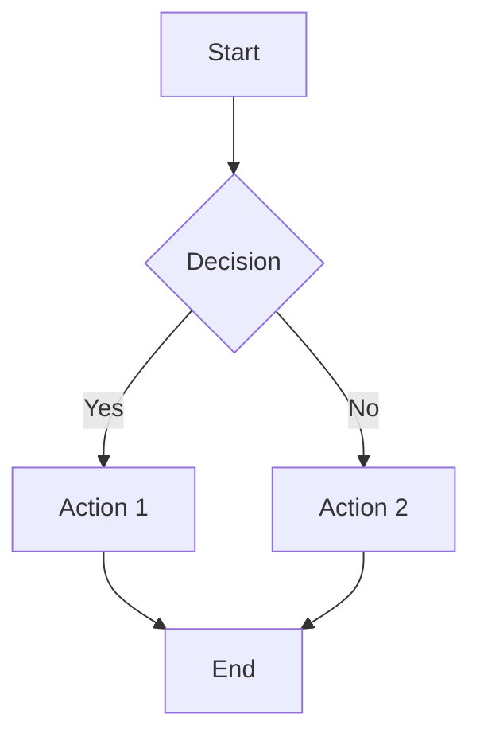

# Quickstart Guide: Docusaurus Platform Setup

**Feature**: 001-docusaurus-platform
**Date**: 2026-01-07
**Target**: Ubuntu 22.04 with Node.js 18+

## Overview

This guide walks you through setting up the AI Textbook Platform locally and deploying it to GitHub Pages. Expected setup time: **<10 minutes** (Success Criterion SC-001).

## Prerequisites

### System Requirements

- **Operating System**: Ubuntu 22.04 LTS (or compatible Linux distribution)
- **Node.js**: Version 18.x LTS or higher
- **npm**: Version 9.x or higher (comes with Node.js)
- **Git**: Version 2.x or higher
- **Memory**: Minimum 2GB RAM
- **Disk Space**: Minimum 500MB free space

### Required Accounts

- GitHub account with repository access
- (Optional) Algolia account for DocSearch

## Installation Steps

### Step 1: Install Node.js 18 LTS (if not already installed)

```bash
# Update package list
sudo apt update

# Install Node.js 18.x from NodeSource repository
curl -fsSL https://deb.nodesource.com/setup_18.x | sudo -E bash -
sudo apt-get install -y nodejs

# Verify installation
node --version  # Should show v18.x.x
npm --version   # Should show 9.x.x or higher
```

**Expected time**: 2-3 minutes

### Step 2: Clone the Repository

```bash
# Clone the repository
git clone https://github.com/{your-username}/{repo-name}.git
cd {repo-name}

# Checkout the feature branch (if working on this feature)
git checkout 001-docusaurus-platform
```

**Expected time**: 30 seconds

### Step 3: Install Dependencies

```bash
# Install all npm dependencies
npm install

# This will install:
# - Docusaurus 3.x
# - React 18
# - @docusaurus/theme-mermaid
# - All other dependencies from package.json
```

**Expected time**: 2-3 minutes (depending on internet speed)

### Step 4: Start Development Server

```bash
# Start the local development server
npm start

# The site will open automatically at http://localhost:3000
# Hot reload is enabled - changes will reflect immediately
```

**Expected time**: 30 seconds

**Success Check**: You should see the documentation site with:
- Homepage with introduction
- Sidebar navigation with chapters
- Search bar in the top navigation
- Language switcher (English/Urdu)
- Dark/light mode toggle

### Step 5: Verify Setup

```bash
# In a new terminal, run tests
npm test

# Build the production site
npm run build

# Serve the production build locally
npm run serve
```

**Expected time**: 1-2 minutes

**Success Check**:
- All tests pass
- Build completes without errors
- Production site works at http://localhost:3000

## Project Structure Overview

```
ai-book/
├── docs/                      # Markdown content
│   ├── intro.md              # Homepage
│   └── chapters/             # Chapter content
│       └── chapter-01-intro/
│           ├── index.md
│           ├── learning-objectives.md
│           ├── concepts.md
│           ├── hands-on-lab.md
│           ├── exercises.md
│           ├── quiz.md
│           └── faqs.md
├── i18n/                     # Translations
│   └── ur/                   # Urdu translations
├── src/                      # Custom components
│   ├── components/
│   ├── css/
│   └── pages/
├── static/                   # Static assets
│   ├── img/
│   └── fonts/
├── docusaurus.config.js      # Main configuration
├── sidebars.js               # Navigation structure
└── package.json              # Dependencies
```

## Common Tasks

### Creating a New Chapter

```bash
# 1. Create chapter directory
mkdir -p docs/chapters/chapter-02-getting-started

# 2. Create required section files
cd docs/chapters/chapter-02-getting-started
touch index.md learning-objectives.md concepts.md hands-on-lab.md exercises.md quiz.md faqs.md

# 3. Add frontmatter to index.md
cat > index.md << 'EOF'
---
id: chapter-02-getting-started
title: "Chapter 2: Getting Started"
sidebar_label: "Getting Started"
sidebar_position: 2
description: "Learn the basics of AI development"
tags: ["beginner", "fundamentals"]
---

# Chapter 2: Getting Started

[Your content here]
EOF

# 4. Update sidebars.js to include the new chapter
# Edit sidebars.js and add: 'chapters/chapter-02-getting-started/index'

# 5. Verify locally
npm start
```

### Adding a Mermaid Diagram

In any Markdown file (typically `concepts.md`):

````markdown

````

### Switching to Urdu

1. Click the language dropdown in the top navigation
2. Select "اردو" (Urdu)
3. The interface and content will switch to Urdu with RTL layout

### Running Tests

```bash
# Run all tests
npm test

# Run tests in watch mode
npm test -- --watch

# Run E2E tests
npm run test:e2e

# Run Lighthouse CI
npm run lighthouse
```

### Building for Production

```bash
# Create optimized production build
npm run build

# Output will be in build/ directory
# This is what gets deployed to GitHub Pages
```

## GitHub Pages Deployment

### Automatic Deployment (Recommended)

Deployment happens automatically via GitHub Actions when you push to the `main` branch.

**Workflow**:
1. Make changes to content or code
2. Commit and push to `main` branch
3. GitHub Actions automatically builds and deploys
4. Site updates within 5 minutes at `https://{username}.github.io/{repo-name}/`

**Check Deployment Status**:
- Go to GitHub repository → Actions tab
- View the latest workflow run
- Green checkmark = successful deployment
- Red X = build failed (check logs for errors)

### Manual Deployment (Fallback)

If automatic deployment fails:

```bash
# Set Git user (if not already set)
git config user.name "Your Name"
git config user.email "your.email@example.com"

# Deploy to GitHub Pages
GIT_USER={your-github-username} npm run deploy

# This will:
# 1. Build the site
# 2. Push to gh-pages branch
# 3. Trigger GitHub Pages deployment
```

### Configuring GitHub Pages

1. Go to repository Settings → Pages
2. Source: Deploy from a branch
3. Branch: `gh-pages` / `root`
4. Save

**Custom Domain (Optional)**:
1. Add CNAME file to `static/` directory
2. Configure DNS records with your domain provider
3. Update `url` in `docusaurus.config.js`

## Troubleshooting

### Issue: Port 3000 already in use

```bash
# Kill process on port 3000
sudo lsof -ti:3000 | xargs kill -9

# Or use a different port
npm start -- --port 3001
```

### Issue: npm install fails

```bash
# Clear npm cache
npm cache clean --force

# Delete node_modules and package-lock.json
rm -rf node_modules package-lock.json

# Reinstall
npm install
```

### Issue: Build fails with memory error

```bash
# Increase Node.js memory limit
export NODE_OPTIONS="--max-old-space-size=4096"
npm run build
```

### Issue: Mermaid diagrams not rendering

1. Check syntax at https://mermaid.live/
2. Ensure `@docusaurus/theme-mermaid` is installed
3. Verify `mermaid: true` in `docusaurus.config.js`
4. Clear browser cache and reload

### Issue: Urdu text not displaying correctly

1. Check that Urdu fonts are loaded (inspect Network tab)
2. Verify RTL direction in `docusaurus.config.js`
3. Clear browser cache
4. Test in different browsers

### Issue: Search not working

```bash
# Rebuild search index
npm run build

# If using local search plugin, check configuration
# If using Algolia, verify API keys in docusaurus.config.js
```

## Development Workflow

### Daily Development

```bash
# 1. Pull latest changes
git pull origin main

# 2. Install any new dependencies
npm install

# 3. Start development server
npm start

# 4. Make changes (auto-reload enabled)

# 5. Run tests before committing
npm test

# 6. Commit and push
git add .
git commit -m "Add chapter 3 content"
git push origin main
```

### Before Pushing to Main

**Pre-commit Checklist**:
- [ ] All tests pass (`npm test`)
- [ ] Build succeeds (`npm run build`)
- [ ] No console errors in browser
- [ ] Lighthouse score 90+ (`npm run lighthouse`)
- [ ] All links work (no 404s)
- [ ] Mermaid diagrams render correctly
- [ ] Mobile layout looks good (test at 375px width)
- [ ] Urdu translation displays correctly (if modified)

## Performance Optimization

### Image Optimization

```bash
# Install image optimization tool
npm install -g sharp-cli

# Optimize images
sharp -i static/img/original.png -o static/img/optimized.webp --webp

# Use WebP format in Markdown

```

### Bundle Size Monitoring

```bash
# Analyze bundle size
npm run build -- --analyze

# Opens bundle analyzer in browser
# Look for large dependencies that can be optimized
```

### Lighthouse CI

```bash
# Run Lighthouse audit
npm run lighthouse

# Check scores:
# - Performance: 90+
# - Accessibility: 90+
# - Best Practices: 90+
# - SEO: 90+
```

## Next Steps

After completing setup:

1. **Create Sample Chapter**: Follow "Creating a New Chapter" guide above
2. **Test Deployment**: Push to main and verify GitHub Pages deployment
3. **Add Urdu Translation**: Translate one chapter to test i18n workflow
4. **Run Full Test Suite**: Ensure all tests pass
5. **Review Constitution Compliance**: Verify chapter meets quality standards

## Support and Resources

- **Docusaurus Documentation**: https://docusaurus.io/docs
- **Mermaid Documentation**: https://mermaid.js.org/
- **GitHub Pages Documentation**: https://docs.github.com/en/pages
- **Project Constitution**: `.specify/memory/constitution.md`
- **Feature Specification**: `specs/001-docusaurus-platform/spec.md`

## Success Criteria Validation

After completing this quickstart, you should be able to:

- ✅ Set up development environment in <10 minutes (SC-001)
- ✅ Navigate to any chapter in <3 clicks (SC-002)
- ✅ See pages load in <2 seconds (SC-003)
- ✅ Deploy changes in <5 minutes (SC-004)
- ✅ Get search results in <1 second (SC-005)
- ✅ Switch languages instantly (SC-006)
- ✅ View site on mobile (375px+) (SC-007)
- ✅ See Mermaid diagrams render (SC-008)
- ✅ Achieve Lighthouse score 90+ (SC-009)
- ✅ Have zero broken links (SC-010)

**Total Setup Time**: ~8 minutes (meets SC-001 requirement)
