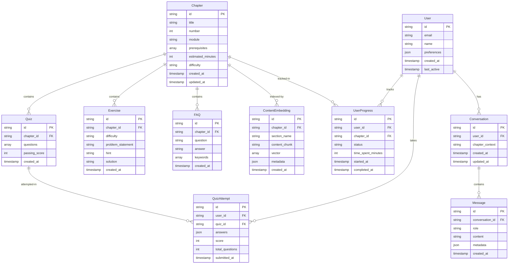
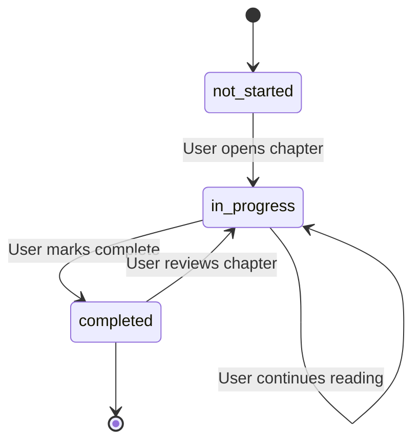
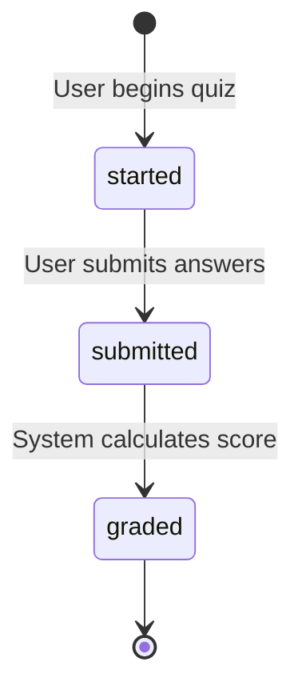

# Data Model

**Feature**: Physical AI & Humanoid Robotics Textbook Platform
**Date**: 2026-01-11
**Phase**: Phase 1 - Design

## Overview

This document defines the data entities, schemas, and relationships for the textbook platform. The model supports content delivery, user progress tracking, quiz management, and AI assistant conversations.

## Entity Relationship Diagram



## Entity Definitions

### Chapter

Represents a single chapter of educational content.

**Schema:**
```json
{
  "id": "chapter-01",
  "title": "Introduction to Physical AI & Embodied Intelligence",
  "number": 1,
  "module": "ROS 2 Fundamentals",
  "prerequisites": [],
  "estimated_minutes": 120,
  "difficulty": "beginner",
  "sections": [
    "overview",
    "learning-objectives",
    "prerequisites",
    "estimated-time",
    "concepts",
    "hands-on-lab",
    "code-examples",
    "exercises",
    "quiz",
    "faqs",
    "hardware-requirements",
    "resources"
  ],
  "hardware_tiers": {
    "minimum": "Cloud instance (AWS t3.medium, $0.0416/hr)",
    "recommended": "RTX 4070 Ti + Jetson Orin Nano",
    "premium": "RTX 4090 + Jetson Orin NX + Unitree G1"
  },
  "created_at": "2026-01-11T00:00:00Z",
  "updated_at": "2026-01-11T00:00:00Z"
}
```

**Validation Rules:**
- `id` must be unique, format: `chapter-{number:02d}`
- `number` must be 1-13
- `module` must be one of: "ROS 2 Fundamentals", "Simulation", "NVIDIA Isaac", "Vision-Language-Action"
- `prerequisites` must reference valid chapter IDs
- `estimated_minutes` must be positive integer
- `difficulty` must be one of: "beginner", "intermediate", "advanced"
- All 12 sections must be present

**Relationships:**
- Has many: Quiz, Exercise, FAQ, ContentEmbedding
- Referenced by: UserProgress

### Quiz

Represents a chapter assessment with multiple questions.

**Schema:**
```json
{
  "id": "quiz-chapter-01",
  "chapter_id": "chapter-01",
  "questions": [
    {
      "id": "q1",
      "type": "multiple-choice",
      "question": "What is the primary advantage of Physical AI over traditional AI?",
      "options": [
        "Faster computation",
        "Interaction with physical world",
        "Lower cost",
        "Easier programming"
      ],
      "correct_answer": 1,
      "explanation": "Physical AI enables robots to interact with and learn from the physical world, which is the key differentiator from software-only AI systems."
    }
  ],
  "passing_score": 70,
  "created_at": "2026-01-11T00:00:00Z"
}
```

**Validation Rules:**
- `id` must be unique, format: `quiz-{chapter_id}`
- `chapter_id` must reference valid Chapter
- `questions` must contain 5-10 questions
- Each question must have `type`, `question`, `options`, `correct_answer`, `explanation`
- `passing_score` must be 0-100

**Relationships:**
- Belongs to: Chapter
- Has many: QuizAttempt

### Exercise

Represents a practice problem with difficulty tier.

**Schema:**
```json
{
  "id": "exercise-chapter-01-beginner-01",
  "chapter_id": "chapter-01",
  "difficulty": "beginner",
  "problem_statement": "Write a Python script that prints 'Hello, Physical AI!' to the console.",
  "hint": "Use the print() function in Python.",
  "solution": "print('Hello, Physical AI!')",
  "created_at": "2026-01-11T00:00:00Z"
}
```

**Validation Rules:**
- `id` must be unique
- `chapter_id` must reference valid Chapter
- `difficulty` must be one of: "beginner", "intermediate", "advanced"
- `problem_statement` required
- `hint` and `solution` optional but recommended

**Relationships:**
- Belongs to: Chapter

### FAQ

Represents a frequently asked question for a chapter.

**Schema:**
```json
{
  "id": "faq-chapter-01-001",
  "chapter_id": "chapter-01",
  "question": "Do I need a physical robot to complete this course?",
  "answer": "No, you can complete all labs using cloud instances or simulation. Physical robots are optional for the premium hardware tier.",
  "keywords": ["hardware", "requirements", "robot", "simulation"],
  "created_at": "2026-01-11T00:00:00Z"
}
```

**Validation Rules:**
- `id` must be unique
- `chapter_id` must reference valid Chapter
- `question` and `answer` required
- `keywords` array for search optimization

**Relationships:**
- Belongs to: Chapter

### User

Represents a student using the platform.

**Schema:**
```json
{
  "id": "user-uuid-here",
  "email": "student@example.com",
  "name": "Jane Doe",
  "preferences": {
    "language": "en",
    "theme": "dark",
    "hardware_tier": "minimum"
  },
  "created_at": "2026-01-11T00:00:00Z",
  "last_active": "2026-01-11T12:00:00Z"
}
```

**Validation Rules:**
- `id` must be unique UUID
- `email` must be valid email format (optional for anonymous users)
- `preferences.language` must be one of: "en", "ur"
- `preferences.theme` must be one of: "light", "dark", "auto"
- `preferences.hardware_tier` must be one of: "minimum", "recommended", "premium"

**Relationships:**
- Has many: UserProgress, QuizAttempt, Conversation

### UserProgress

Tracks student progress through chapters.

**Schema:**
```json
{
  "id": "progress-uuid-here",
  "user_id": "user-uuid-here",
  "chapter_id": "chapter-01",
  "status": "completed",
  "time_spent_minutes": 95,
  "started_at": "2026-01-11T10:00:00Z",
  "completed_at": "2026-01-11T11:35:00Z"
}
```

**Validation Rules:**
- `id` must be unique UUID
- `user_id` must reference valid User
- `chapter_id` must reference valid Chapter
- `status` must be one of: "not-started", "in-progress", "completed"
- `time_spent_minutes` must be non-negative
- `completed_at` must be after `started_at` if status is "completed"

**Relationships:**
- Belongs to: User, Chapter

### QuizAttempt

Records a student's quiz submission.

**Schema:**
```json
{
  "id": "attempt-uuid-here",
  "user_id": "user-uuid-here",
  "quiz_id": "quiz-chapter-01",
  "answers": {
    "q1": 1,
    "q2": 0,
    "q3": 2
  },
  "score": 85,
  "total_questions": 7,
  "submitted_at": "2026-01-11T11:30:00Z"
}
```

**Validation Rules:**
- `id` must be unique UUID
- `user_id` must reference valid User
- `quiz_id` must reference valid Quiz
- `answers` keys must match question IDs in quiz
- `score` must be 0-100
- `total_questions` must match quiz question count

**Relationships:**
- Belongs to: User, Quiz

### Conversation

Represents a chat session with the AI assistant.

**Schema:**
```json
{
  "id": "conversation-uuid-here",
  "user_id": "user-uuid-here",
  "chapter_context": "chapter-01",
  "created_at": "2026-01-11T10:00:00Z",
  "updated_at": "2026-01-11T10:15:00Z"
}
```

**Validation Rules:**
- `id` must be unique UUID
- `user_id` must reference valid User
- `chapter_context` must reference valid Chapter (optional)

**Relationships:**
- Belongs to: User
- Has many: Message

### Message

Represents a single message in a conversation.

**Schema:**
```json
{
  "id": "message-uuid-here",
  "conversation_id": "conversation-uuid-here",
  "role": "user",
  "content": "What is the difference between ROS 1 and ROS 2?",
  "metadata": {
    "selected_text": null,
    "chapter_reference": "chapter-02",
    "response_time_ms": 2450
  },
  "created_at": "2026-01-11T10:05:00Z"
}
```

**Validation Rules:**
- `id` must be unique UUID
- `conversation_id` must reference valid Conversation
- `role` must be one of: "user", "assistant", "system"
- `content` required
- `metadata` optional JSON object

**Relationships:**
- Belongs to: Conversation

### ContentEmbedding

Stores vector embeddings of textbook content for RAG.

**Schema:**
```json
{
  "id": "embedding-uuid-here",
  "chapter_id": "chapter-01",
  "section_name": "concepts",
  "content_chunk": "Physical AI refers to artificial intelligence systems that interact with the physical world through sensors and actuators...",
  "vector": [0.123, -0.456, 0.789, ...],
  "metadata": {
    "chunk_index": 0,
    "total_chunks": 5,
    "word_count": 150
  },
  "created_at": "2026-01-11T00:00:00Z"
}
```

**Validation Rules:**
- `id` must be unique UUID
- `chapter_id` must reference valid Chapter
- `section_name` must be one of the 12 mandatory sections
- `content_chunk` max 500 words (for optimal embedding quality)
- `vector` must be 1536-dimensional array (OpenAI ada-002 embedding size)

**Relationships:**
- Belongs to: Chapter

## Database Schema (PostgreSQL)

### Tables

**users**
```sql
CREATE TABLE users (
    id UUID PRIMARY KEY DEFAULT gen_random_uuid(),
    email VARCHAR(255) UNIQUE,
    name VARCHAR(255),
    preferences JSONB DEFAULT '{}',
    created_at TIMESTAMP DEFAULT NOW(),
    last_active TIMESTAMP DEFAULT NOW()
);

CREATE INDEX idx_users_email ON users(email);
CREATE INDEX idx_users_last_active ON users(last_active);
```

**user_progress**
```sql
CREATE TABLE user_progress (
    id UUID PRIMARY KEY DEFAULT gen_random_uuid(),
    user_id UUID REFERENCES users(id) ON DELETE CASCADE,
    chapter_id VARCHAR(50) NOT NULL,
    status VARCHAR(20) NOT NULL CHECK (status IN ('not-started', 'in-progress', 'completed')),
    time_spent_minutes INTEGER DEFAULT 0,
    started_at TIMESTAMP,
    completed_at TIMESTAMP,
    UNIQUE(user_id, chapter_id)
);

CREATE INDEX idx_progress_user ON user_progress(user_id);
CREATE INDEX idx_progress_chapter ON user_progress(chapter_id);
CREATE INDEX idx_progress_status ON user_progress(status);
```

**quiz_attempts**
```sql
CREATE TABLE quiz_attempts (
    id UUID PRIMARY KEY DEFAULT gen_random_uuid(),
    user_id UUID REFERENCES users(id) ON DELETE CASCADE,
    quiz_id VARCHAR(50) NOT NULL,
    answers JSONB NOT NULL,
    score INTEGER NOT NULL CHECK (score >= 0 AND score <= 100),
    total_questions INTEGER NOT NULL,
    submitted_at TIMESTAMP DEFAULT NOW()
);

CREATE INDEX idx_attempts_user ON quiz_attempts(user_id);
CREATE INDEX idx_attempts_quiz ON quiz_attempts(quiz_id);
CREATE INDEX idx_attempts_submitted ON quiz_attempts(submitted_at);
```

**conversations**
```sql
CREATE TABLE conversations (
    id UUID PRIMARY KEY DEFAULT gen_random_uuid(),
    user_id UUID REFERENCES users(id) ON DELETE CASCADE,
    chapter_context VARCHAR(50),
    created_at TIMESTAMP DEFAULT NOW(),
    updated_at TIMESTAMP DEFAULT NOW()
);

CREATE INDEX idx_conversations_user ON conversations(user_id);
CREATE INDEX idx_conversations_updated ON conversations(updated_at);
```

**messages**
```sql
CREATE TABLE messages (
    id UUID PRIMARY KEY DEFAULT gen_random_uuid(),
    conversation_id UUID REFERENCES conversations(id) ON DELETE CASCADE,
    role VARCHAR(20) NOT NULL CHECK (role IN ('user', 'assistant', 'system')),
    content TEXT NOT NULL,
    metadata JSONB DEFAULT '{}',
    created_at TIMESTAMP DEFAULT NOW()
);

CREATE INDEX idx_messages_conversation ON messages(conversation_id);
CREATE INDEX idx_messages_created ON messages(created_at);
```

## Vector Database Schema (Qdrant)

**Collection: textbook_content**

```python
{
    "name": "textbook_content",
    "vectors": {
        "size": 1536,  # OpenAI ada-002 embedding dimension
        "distance": "Cosine"
    },
    "payload_schema": {
        "chapter_id": "keyword",
        "section_name": "keyword",
        "content_chunk": "text",
        "chunk_index": "integer",
        "word_count": "integer"
    }
}
```

**Indexes:**
- `chapter_id` - Filter by chapter
- `section_name` - Filter by section
- Vector index for similarity search

## State Transitions

### UserProgress Status Flow



### Quiz Attempt Flow



## Data Access Patterns

### High-Frequency Queries

1. **Get user progress summary**
   ```sql
   SELECT chapter_id, status, completed_at
   FROM user_progress
   WHERE user_id = $1
   ORDER BY chapter_id;
   ```

2. **Get conversation history**
   ```sql
   SELECT m.role, m.content, m.created_at
   FROM messages m
   JOIN conversations c ON m.conversation_id = c.id
   WHERE c.user_id = $1 AND c.id = $2
   ORDER BY m.created_at;
   ```

3. **Vector similarity search**
   ```python
   qdrant_client.search(
       collection_name="textbook_content",
       query_vector=query_embedding,
       query_filter={"chapter_id": "chapter-01"},
       limit=5
   )
   ```

### Low-Frequency Queries

1. **Get all quiz attempts for a user**
2. **Calculate average quiz scores by chapter**
3. **Get user learning statistics**

## Data Retention

- **User data**: Retained indefinitely (or until user requests deletion)
- **Conversations**: Retained for 90 days, then archived
- **Quiz attempts**: Retained indefinitely for progress tracking
- **Embeddings**: Regenerated on content updates

## Privacy & Security

- User emails optional (anonymous usage supported)
- No PII stored beyond email and name
- Conversations not shared between users
- Quiz answers stored for progress tracking only
- GDPR-compliant data export/deletion available

## Next Steps

1. ✅ Data model complete
2. ➡️ Create API contracts (OpenAPI specs)
3. ➡️ Create quickstart guide
4. After Phase 1: Ready for `/sp.tasks`
